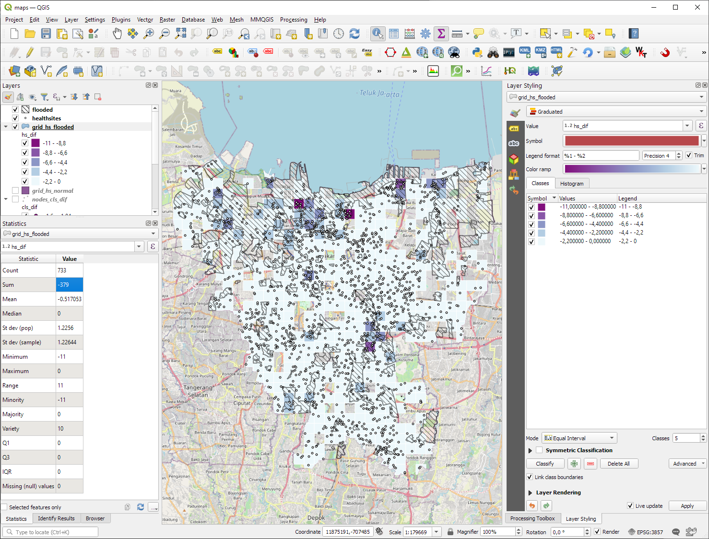

```{r setup, include=FALSE}
knitr::opts_chunk$set(echo = TRUE)

def.chunk.hook  <- knitr::knit_hooks$get("chunk")
knitr::knit_hooks$set(chunk = function(x, options) {
  x <- def.chunk.hook(x, options)
  ifelse(options$size != "normalsize", paste0("\n \\", options$size,"\n\n", x, "\n\n \\normalsize"), x)
})
```

```{r logo, eval=TRUE, echo=FALSE, message=FALSE, fig.align='center', out.width='0.3\\linewidth', fig.pos='H'}
temp <- tempfile(fileext = ".pdf")
download.file(url = "https://reproducible-agile.github.io/public/images/reproducible-AGILE-logo-square.pdf", destfile = temp)
knitr::include_graphics(temp)
```

This report is part of the reproducibility review at the AGILE conference.
For more information see [https://reproducible-agile.github.io/](https://reproducible-agile.github.io/).
This document is published on OSF at OSF LINK HERE.
To cite the report use

> Graser, A. (2021, May). Reproducibility review of: Flood Impact Assessment on Road Network and Healthcare Access – at the example of Jakarta, Indonesia. <https://doi.org/TODO>

# Reviewed paper

Isabell G. Klipper, Alexander Zipf and Sven Lautenbach. Flood Impact Assessment on Road Network and Healthcare Access – at the example of Jakarta, Indonesia

# Summary

The provided workflow was **partially reproduced**.
The figures generated using the provided source code are not identical to the figures in the paper. However, many of the results reported in the paper could be reproduced, as described in detail in the following notes.


\clearpage

# Reproducibility reviewer notes

The Data and Software Availability section lists two relevant repositories: <https://github.com/GIScience/Jakarta_Thesis_Klipper> for the Python code used for the analysis of network centrality and accessibility and <https://gitlab.gistools.geog.uni-heidelberg.de/giscience/big-data/ohsome/ohsome-api-analysis-examples/completeness_highway_healthsites_jakarta> for the R code used to assess the intrinsic data quality. 


I started with the repository <https://github.com/GIScience/Jakarta_Thesis_Klipper> mentioned in the Data and Software Availability section. 
Usage instructions are provided in the repo README.md.
Issues in the original version <https://github.com/GIScience/Jakarta_Thesis_Klipper/tree/a6887825b28006d0a00febf656384e985bfeead3> were fixed during the reproduction period  <https://github.com/GIScience/Jakarta_Thesis_Klipper/tree/47340958ae75ed34fca75cb3942c41d4413286ac>. The repository contains test data for Heidelberg. To reproduce the results in the paper, the authors provided the Jakarta dataset via email. 
To use the Jakarta dataset, file paths in the `settings.yml` had to be updated accordingly. The updated `settings.yml` is provided in the reproduction report repository. 


## Installation (Python repo)

Readme instruction "To additionally install GDAL properly, run:

```{bash install1, eval=FALSE, size="scriptsize"}
pip install GDAL==$(gdal-config --version) --global-option=build_ext --global-option="-I/usr/include/gdal"
```

failed with `missing gdal-config`.


Attempt to install as recommended by Ubuntu:

```{bash install2, eval=FALSE, size="scriptsize"}
sudo apt install libgdal-dev
```

failed with 

```{bash install3, eval=FALSE, size="scriptsize"}
Ign:1 http://archive.ubuntu.com/ubuntu focal-updates/main amd64 libmysqlclient21 amd64 8.0.22-0ubuntu0.20.04.3
Err:2 http://archive.ubuntu.com/ubuntu focal-updates/main amd64 libc-dev-bin amd64 2.31-0ubuntu9.1
  404  Not Found [IP: 91.189.88.142 80]
Ign:3 http://archive.ubuntu.com/ubuntu focal-updates/main amd64 linux-libc-dev amd64 5.4.0-56.62
Err:4 http://archive.ubuntu.com/ubuntu focal-updates/main amd64 libc6-dev amd64 2.31-0ubuntu9.1
  404  Not Found [IP: 91.189.88.142 80]
Ign:5 http://archive.ubuntu.com/ubuntu focal-updates/main amd64 libmysqlclient-dev amd64 8.0.22-0ubuntu0.20.04.3
Ign:6 http://archive.ubuntu.com/ubuntu focal-updates/main amd64 libcurl4-gnutls-dev amd64 7.68.0-1ubuntu2.2
Ign:7 http://archive.ubuntu.com/ubuntu focal-updates/main amd64 libpq5 amd64 12.5-0ubuntu0.20.04.1
Err:1 http://security.ubuntu.com/ubuntu focal-updates/main amd64 libmysqlclient21 amd64 8.0.22-0ubuntu0.20.04.3
  404  Not Found [IP: 91.189.88.142 80]
Err:3 http://security.ubuntu.com/ubuntu focal-updates/main amd64 linux-libc-dev amd64 5.4.0-56.62
  404  Not Found [IP: 91.189.88.142 80]
Err:5 http://security.ubuntu.com/ubuntu focal-updates/main amd64 libmysqlclient-dev amd64 8.0.22-0ubuntu0.20.04.3
  404  Not Found [IP: 91.189.88.142 80]
Err:6 http://security.ubuntu.com/ubuntu focal-updates/main amd64 libcurl4-gnutls-dev amd64 7.68.0-1ubuntu2.2
  404  Not Found [IP: 91.189.88.142 80]
Err:7 http://security.ubuntu.com/ubuntu focal-updates/main amd64 libpq5 amd64 12.5-0ubuntu0.20.04.1
  404  Not Found [IP: 91.189.88.142 80]
Ign:8 http://archive.ubuntu.com/ubuntu focal-updates/main amd64 libpq-dev amd64 12.5-0ubuntu0.20.04.1
Err:8 http://security.ubuntu.com/ubuntu focal-updates/main amd64 libpq-dev amd64 12.5-0ubuntu0.20.04.1
  404  Not Found [IP: 91.189.88.142 80]
E: Failed to fetch http://security.ubuntu.com/ubuntu/pool/main/m/mysql-8.0/libmysqlclient21_8.0.22-0ubuntu0.20.04.3_amd64.deb  404  Not Found [IP: 91.189.88.142 80]
E: Failed to fetch http://archive.ubuntu.com/ubuntu/pool/main/g/glibc/libc-dev-bin_2.31-0ubuntu9.1_amd64.deb  404  Not Found [IP: 91.189.88.142 80]
E: Failed to fetch http://security.ubuntu.com/ubuntu/pool/main/l/linux/linux-libc-dev_5.4.0-56.62_amd64.deb  404  Not Found [IP: 91.189.88.142 80]
E: Failed to fetch http://archive.ubuntu.com/ubuntu/pool/main/g/glibc/libc6-dev_2.31-0ubuntu9.1_amd64.deb  404  Not Found [IP: 91.189.88.142 80]
E: Failed to fetch http://security.ubuntu.com/ubuntu/pool/main/m/mysql-8.0/libmysqlclient-dev_8.0.22-0ubuntu0.20.04.3_amd64.deb  404  Not Found [IP: 91.189.88.142 80]
E: Failed to fetch http://security.ubuntu.com/ubuntu/pool/main/c/curl/libcurl4-gnutls-dev_7.68.0-1ubuntu2.2_amd64.deb  404  Not Found [IP: 91.189.88.142 80]
E: Failed to fetch http://security.ubuntu.com/ubuntu/pool/main/p/postgresql-12/libpq5_12.5-0ubuntu0.20.04.1_amd64.deb  404  Not Found [IP: 91.189.88.142 80]
E: Failed to fetch http://security.ubuntu.com/ubuntu/pool/main/p/postgresql-12/libpq-dev_12.5-0ubuntu0.20.04.1_amd64.deb  404  Not Found [IP: 91.189.88.142 80]
E: Unable to fetch some archives, maybe run apt-get update or try with --fix-missing?
```

Installed using conda instead:

```{bash install4, eval=FALSE, size="scriptsize"}
conda install gdal
```


## 1. Data preprocessing

Preprocessing was run with the `HOT` option, as confirmed by the authors. The error message relation to `proj.db` does not seem to impact the generation of necessary output files.

```{bash step1, eval=FALSE, size="scriptsize"}
(jakarta_venv) agraser@anitas-pc:~/agile-reproductions/paper-2021-11/Jakarta_Thesis_Klipper$ python -m ma_jakarta.scripts.data_preprocessing.run_preprocessing HOT
preprocessed/hd_border.shp saved.
preprocessed/flooded.shp saved.
preprocessed/healthsites.shp saved.
preprocessed/healthsites_flooded.shp saved.
ERROR 1: PROJ: proj_identify: /home/agraser/miniconda3/envs/jakarta_venv/share/proj/proj.db lacks DATABASE.LAYOUT.VERSION.MAJOR / DATABASE.LAYOUT.VERSION.MINOR metadata. It comes from another PROJ installation.
input/jakarta/idn_ppp_2020.tif saved.
```

## 2. Road network

### 2.1. Download and preperation of network graph

The road network for Jakarta was downloaded using:

```{bash step2.1, eval=FALSE, size="scriptsize"}
(jakarta_venv) agraser@anitas-pc:~/agile-reproductions/Jakarta_Thesis_Klipper$ python -m ma_jakarta.scripts.network.download_network 'Jakarta, Indonesia' 'drive_service' 'normal' 'ma_jakarta/network_graphs'
normal graph data saved in: ma_jakarta/network_graphs/normal
```

### 2.2. Network centrality (and creation of flood related network)

Normal network centrality measures were calculated using:

```{bash step2.2a, eval=FALSE, size="scriptsize"}
(jakarta_venv) agraser@anitas-pc:~/agile-reproductions/paper-2021-11/Jakarta_Thesis_Klipper$ python -m ma_jakarta.scripts.network.run_network normal Betweenness Closeness
Network Properties:
nodes, edges                    155995, 204658
directed?                       True
weighted?                       True
isolated nodes                  36391
self-loops                      341
density                         0.000008
min/max/avg degree              0, 5, 1.311952
degree assortativity            0.007009
number of connected components  131182
size of largest component       20387 (13.07 %)
Created weighted NetworKit graph.
[(102933, 0.002901351323908125),
 (39521, 0.0027094797711693696),
 (32932, 0.0026536290042804183),
 (115431, 0.002653575293361472),
 (76073, 0.0026205982274465868),
 (120298, 0.00254978155201745),
 (58469, 0.0025497278410985032),
 (134169, 0.002549674130179557),
 (150225, 0.00254962041926061),
 (92025, 0.0025350645547519857)]
Betweenness calculated
[(146030, 2.414223489700397),
 (3535, 2.236996979444534),
 (148463, 2.0216411856626046),
 (143027, 1.9263688547432862),
 (88296, 1.9253694128773569),
 (66801, 1.8745620907697444),
 (47735, 1.8724592677886949),
 (88530, 1.8700852658684035),
 (81095, 1.8609954542643954),
 (118364, 1.857541131419174)]
Closeness calculated
Centrality saved: /home/agraser/agile-reproductions/paper-2021-11/Jakarta_Thesis_Klipper/ma_jakarta/data/results/network/normal/nodes_centrality.shp
```


Flooded network centrality was calculated using:

```{bash step2.2b, eval=FALSE, size="scriptsize"}
(jakarta_venv) agraser@anitas-pc:~/agile-reproductions/paper-2021-11/Jakarta_Thesis_Klipper$ python -m ma_jakarta.scripts.network.run_network flooded Betweenness Closeness
Directory /home/agraser/agile-reproductions/paper-2021-11/Jakarta_Thesis_Klipper/ma_jakarta/data/results/network/flooded created
flooded
Directory /home/agraser/agile-reproductions/paper-2021-11/Jakarta_Thesis_Klipper/ma_jakarta/network_graphs/flooded created
Amount of intersected and removed nodes: 36311
Warning 1: One or several characters couldn't be converted correctly from UTF-8 to ISO-8859-1.  This warning will not be emitted anymore.
Intersected networkx graph saved
Network Properties:
nodes, edges                    119684, 154603
directed?                       True
weighted?                       True
isolated nodes                  28578
self-loops                      247
density                         0.000011
min/max/avg degree              0, 5, 1.291760
degree assortativity            0.008635
number of connected components  103901
size of largest component       9206 (7.69 %)
Created weighted NetworKit graph.
[(4668, 0.004048188882717679),
 (43517, 0.004044745965828773),
 (87157, 0.003095476197477376),
 (87948, 0.0030953730132945185),
 (39975, 0.00297666798852307),
 (39976, 0.002976564804340212),
 (78407, 0.0029419340143956034),
 (22319, 0.002823871621832006),
 (57920, 0.0028237684376491486),
 (101938, 0.002822593618008332)]
Betweenness calculated
[(111951, 2.442676976130915),
 (104985, 2.0251706933103026),
 (113971, 1.7585514578275194),
 (2740, 1.7482833074624562),
 (68264, 1.7334204547143437),
 (109564, 1.6954640193597772),
 (51998, 1.572933239442508),
 (78251, 1.4904068721989487),
 (71871, 1.469294387868634),
 (48382, 1.4669275261543913)]
Closeness calculated
Centrality saved: /home/agraser/agile-reproductions/paper-2021-11/Jakarta_Thesis_Klipper/ma_jakarta/data/results/network/flooded/nodes_centrality.shp
```


The paper states that "A few nodes in the center of the city gained in betweenness centrality but on average the value decreased slightly from 0.00004 to 0.00002"
and "On average the HC value decreased from 0.25 to 0.13".

The reproduction results are similar but not identical: 
For the "normal" scenario `normal/nodes_centrality.shp`, QGIS statistics panel reports a mean `btwn` value of `3.413e-05` and a mean `cls` value of `0.223956`.
For the "flooded" scenario `flooded/nodes_centrality.shp`, QGIS statistics panel reports a mean `btwn` value of `1.8945e-05` and a mean `cls` value of `0.119481`. 


### 2.3. Network resilience

#### 2.3.1 Empirical value distribution as CDF and histogram

CDF and histograms of centraliy values were computed using:

```{bash step2.3.1a, eval=FALSE, size="scriptsize"}
(jakarta_venv) agraser@anitas-pc:~/agile-reproductions/paper-2021-11/Jakarta_Thesis_Klipper$ python -m ma_jakarta.scripts.analysis.network_resilience.emp_value_distribution Betweenness
/home/agraser/agile-reproductions/paper-2021-11/Jakarta_Thesis_Klipper/ma_jakarta/scripts/analysis/network_resilience/emp_value_distribution.py:167: UserWarning: Tight layout not applied. The left and right margins cannot be made large enough to accommodate all axes decorations.
  plt.tight_layout()
CDF results saved.
Histogram results saved.
```

The resulting plots are not identical to the plots presented in the paper in Figure 4. Therefore, it is not straightforward to compare the results:

```{r, eval=TRUE, echo=FALSE, message=FALSE, fig.align='center', fig.show='hold', out.width='0.45\\linewidth', fig.pos='H'}
knitr::include_graphics(c('cdf_btwn.png','hist_btwn.png'))
```


```{bash step2.3.1b, eval=FALSE, size="scriptsize"}
(jakarta_venv) agraser@anitas-pc:~/agile-reproductions/paper-2021-11/Jakarta_Thesis_Klipper$ python -m ma_jakarta.scripts.analysis.network_resilience.emp_value_distribution Closeness
/home/agraser/agile-reproductions/paper-2021-11/Jakarta_Thesis_Klipper/ma_jakarta/scripts/analysis/network_resilience/emp_value_distribution.py:167: UserWarning: Tight layout not applied. The left and right margins cannot be made large enough to accommodate all axes decorations.
  plt.tight_layout()
CDF results saved.
Histogram results saved.
```

```{r, eval=TRUE, echo=FALSE, message=FALSE, fig.align='center', fig.show='hold', out.width='0.45\\linewidth', fig.pos='H'}
knitr::include_graphics(c('cdf_cls.png','hist_cls.png'))
```


#### 2.3.2. Flood impact on network centrality

```{bash step2.3.2, eval=FALSE, size="scriptsize"}
(jakarta_venv) agraser@anitas-pc:~/agile-reproductions/paper-2021-11/Jakarta_Thesis_Klipper$ python -m ma_jakarta.scripts.analysis.network_resilience.node_difference Betweenness Closeness
Results saved in: /home/agraser/agile-reproductions/paper-2021-11/Jakarta_Thesis_Klipper/ma_jakarta/data results/network/flooded/nodes_btwn_dif.shp
Results saved in: /home/agraser/agile-reproductions/paper-2021-11/Jakarta_Thesis_Klipper/ma_jakarta/data results/network/flooded/nodes_cls_dif.shp
```


The paper states that "Strongest losses in HC value occurred in nodes located near the city border".
This result could not be reproduced, as shown in the following screenshot:

```{r, eval=TRUE, echo=FALSE, message=FALSE, fig.align='center', fig.show='hold', out.width='1.0\\linewidth', fig.pos='H'}

```


#### 2.3.3. Small and large foreground network as well as sameness ratio

```{bash step2.3.3, eval=FALSE, size="scriptsize"}
(jakarta_venv) agraser@anitas-pc:~/agile-reproductions/paper-2021-11/Jakarta_Thesis_Klipper$ python -m ma_jakarta.scripts.analysis.network_resilience.resilience Betweenness
/home/agraser/agile-reproductions/paper-2021-11/Jakarta_Thesis_Klipper/ma_jakarta/data/results/network/flooded/nodes_btwn_top_1.shp
/home/agraser/agile-reproductions/paper-2021-11/Jakarta_Thesis_Klipper/ma_jakarta/data/results/network/flooded/nodes_btwn_top_10.shp
Column and data explanation:
column name in_n_f = in normal and flooded foreground network
-999 = node is flooded
999 = node is not flooded but not in top x percent
Sameness Betweenness Ratio: 0.6222193730367331


(jakarta_venv) agraser@anitas-pc:~/agile-reproductions/paper-2021-11/Jakarta_Thesis_Klipper$ python -m ma_jakarta.scripts.analysis.network_resilience.resilience Closeness
/home/agraser/agile-reproductions/paper-2021-11/Jakarta_Thesis_Klipper/ma_jakarta/data/results/network/flooded/nodes_cls_top_1.shp
/home/agraser/agile-reproductions/paper-2021-11/Jakarta_Thesis_Klipper/ma_jakarta/data/results/network/flooded/nodes_cls_top_10.shp
Column and data explanation:
column name in_n_f = in normal and flooded foreground network
-999 = node is flooded
999 = node is not flooded but not in top x percent
Sameness Closeness Ratio: 0.6844028463363037
```

The paper states that "The sameness ratio between the normal and the flooded situation was 0.62 for BC" and "0.69 for HC". This can be considered identical if the reproduced closeness ratio value is rounded up. 


## 3. Healthcare access


### 3.1. Healthcare supply

```{bash step3.1, eval=FALSE, size="scriptsize"}
(jakarta_venv) agraser@anitas-pc:~/agile-reproductions/paper-2021-11/Jakarta_Thesis_Klipper$ python -m ma_jakarta.scripts.analysis.health_distribution normal health_location bed_capacity
/home/agraser/miniconda3/envs/jakarta_venv/lib/python3.7/site-packages/geopandas/tools/sjoin.py:61: UserWarning: CRS of frames being joined does not match!(None != epsg:4326)
  "(%s != %s)" % (left_df.crs, right_df.crs)
Result saved: /home/agraser/agile-reproductions/paper-2021-11/Jakarta_Thesis_Klipper/ma_jakarta/data/results/health_location/grid_hs_normal.shp
Result saved: /home/agraser/agile-reproductions/paper-2021-11/Jakarta_Thesis_Klipper/ma_jakarta/data/results/bed_capacity/grid_bed_normal.shp


(jakarta_venv) agraser@anitas-pc:~/agile-reproductions/paper-2021-11/Jakarta_Thesis_Klipper$ python -m ma_jakarta.scripts.analysis.health_distribution flooded health_location bed_capacity
/home/agraser/miniconda3/envs/jakarta_venv/lib/python3.7/site-packages/geopandas/tools/sjoin.py:61: UserWarning: CRS of frames being joined does not match!(None != epsg:4326)
  "(%s != %s)" % (left_df.crs, right_df.crs)
Result saved: /home/agraser/agile-reproductions/paper-2021-11/Jakarta_Thesis_Klipper/ma_jakarta/data/results/health_location/grid_hs_flooded.shp
Result saved: /home/agraser/agile-reproductions/paper-2021-11/Jakarta_Thesis_Klipper/ma_jakarta/data/results/bed_capacity/grid_bed_flooded.shp
```


The paper states that "Due to the flood event, 30 (15%) hospitals and 349 (25%) clinics were affected and were considered as no longer functional for our analysis. This led to a reduction of 12,000 (16.6%) and 34,500 (25.8%) beds in hospitals and clinics respectively".
The sum of 379 affected heath service locations could be confirmed, as shown in the following screenshot:

```{r, eval=TRUE, echo=FALSE, message=FALSE, fig.align='center', fig.show='hold', out.width='1.0\\linewidth', fig.pos='H'}

```

The number of affected beds according to the reproduction is `46723`.


### 3.2. Mobility-based accessibility

Failed to reproduce due to problems with generating the openrouteservice car graph.


## Intrinsic Data Quality Assessment (R repo)

Failed to reproduce in time.


```{r, echo=FALSE, eval=FALSE, results='hide'}
# create ZIP of reproduction files and upload to OSF
library("zip")
library("here")

zipfile <- here::here("PATH/agile-reproreview-YEAR-NUMBER.zip")
file.remove(zipfile)
zip::zipr(zipfile,
          here::here("2020-018/files to add to the zip, if any"))

library("osfr") # See docs at https://docs.ropensci.org/osfr/
# OSF_PAT is in .Renviron in parent directory
# We cannot use osfr to create a new component (with osfr::osf_create_component(x = osfr::osf_retrieve_node("6k5fh"), ...) because that will set the storage location to outside Europe.

# retrieve project
project <- osfr::osf_retrieve_node("OSF ID")

# upload files
osfr::osf_upload(x = project,
                 conflicts = "overwrite",
                 path = c(list.files(here::here("PATH"),
                                     pattern = "agile-reproreview-.*(pdf$|Rmd$|zip$)",
                                     full.names = TRUE),
                          "COPYRIGHT"
                          )
                 )
```