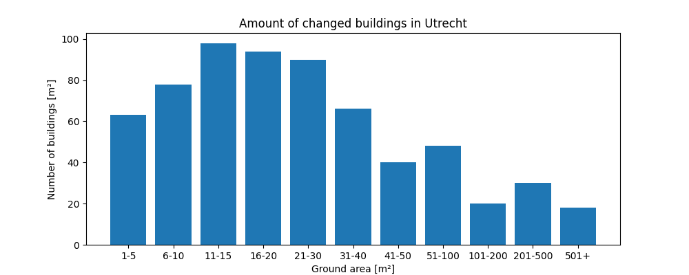

```{r setup, include=FALSE}
knitr::opts_chunk$set(echo = TRUE)

def.chunk.hook  <- knitr::knit_hooks$get("chunk")
knitr::knit_hooks$set(chunk = function(x, options) {
  x <- def.chunk.hook(x, options)
  ifelse(options$size != "normalsize", paste0("\n \\", options$size,"\n\n", x, "\n\n \\normalsize"), x)
})
```


```{r logo, eval=TRUE, echo=FALSE, message=FALSE, fig.align='center', out.width='0.3\\linewidth', fig.pos='H'}
temp <- tempfile(fileext = ".pdf")
download.file(url = "https://reproducible-agile.github.io/public/images/reproducible-AGILE-logo-square.pdf", destfile = temp)
knitr::include_graphics(temp)
```

This report is part of the reproducibility review at the AGILE conference.
For more information see [https://reproducible-agile.github.io/](https://reproducible-agile.github.io/).
This document is published on OSF at https://osf.io/RSF4M/.

To cite the report use

*Friese, Philipp A. (2021). Reproducibility review of: Building Change Detection of Airborne Laser Scanning and Dense Image Matching Point Clouds using Height and Class Information. https://doi.org/10.17605/OSF.IO/RSF4M* 

# Reviewed paper

*Florian Politz, Monika Sester and Claus Brenner (2021). Building Change Detection of Airborne Laser Scanning and Dense Image Matching Point Clouds using Height and Class Information.*


# Summary

The paper data and software are not publicly available due to licence issues with the cooperating parties. For the scope of this reproduction however, the authors provided a synthetic data set, a script to generating a synthetic data set from a publicly available data source, and the analysis code. Using the public data source and applying synthetic changes resulted in a run-time error. Using the provided synthetic data set the executability of the provided analysis code was confirmed. The methodology behind all figures has been reproduced. During all communication, the authors showed concern and dedication for the reproducibility of their work. *The reproduction was partially successful*.

\clearpage

# Reproducibility reviewer notes

The original submission did not contain a Data and Software Availability section, but provided this information in a separate subsection. Due to licence issues, neither code nor data are available publicly. For reproduction purposes only the authors provided the analysis code, a link to a publicly accessible data set from [Publieke Dienstverlening Op de Kaart (PDOK)](pdok.nl) and a means of generating a synthetic data set from it. The authors additionally provided an already generated synthetic data set. An expected run-time of all steps involved was provided.

After generating a synthetic data set and starting the calculation of height and class changes, an out-of-bounds error stopped reproduction using the publicly available data source^[Deprecation warnings are shortened to enhance readability.]:

<!-- Full deprecation warnings:
ChangeDetection.py:54: DeprecationWarning: `np.int` is a deprecated alias for the builtin `int`. 
To silence this warning, use `int` by itself. Doing this will not modify any behavior and is safe. 
When replacing `np.int`, you may wish to use e.g. `np.int64` or `np.int32` to specify the precision. 
If you wish to review your current use, check the release note link for additional information.
Deprecated in NumPy 1.20; for more details and guidance: https://numpy.org/devdocs/release/1.20.0-notes.html#deprecations
  self._cc_ref = (np.where((true_unfiltered == 1) | (true_unfiltered == 2), 1, 0).astype(np.int))
ChangeDetection.py:77: DeprecationWarning: `np.int` is a deprecated alias for the builtin `int`. 
To silence this warning, use `int` by itself. Doing this will not modify any behavior and is safe. 
When replacing `np.int`, you may wish to use e.g. `np.int64` or `np.int32` to specify the precision. 
If you wish to review your current use, check the release note link for additional information.
Deprecated in NumPy 1.20; for more details and guidance: https://numpy.org/devdocs/release/1.20.0-notes.html#deprecations
  self._cc_xor = np.logical_xor(self._max_1 == 2, self._max_2 == 2).astype(np.int)
-->
```{bash crashlog, eval=FALSE, size="scriptsize"}
% python3 ChangeDetection.py

########################################
Start with ChangeDetection.py.
########################################

ChangeDetection.py:54: DeprecationWarning: `np.int` is a deprecated alias for the builtin `int`. 
[...]
  self._cc_ref = (np.where((true_unfiltered == 1) | (true_unfiltered == 2), 1, 0).astype(np.int))
ChangeDetection.py:77: DeprecationWarning: `np.int` is a deprecated alias for the builtin `int`. 
[...]
  self._cc_xor = np.logical_xor(self._max_1 == 2, self._max_2 == 2).astype(np.int)
Data loaded in 2.64s.
Start calculating class change probabilities.
Class change probabilities are calculated and saved. It took 13.43s (0.22)min.
########################################

Start calculating height change probabilities.
The input values are
--height_threshold as 2
--jsdistance as True
--jsd_unit as 0.5

processing for 0
Finished 100000/985198 for 0th tile. Time so far on that tile: 46.40s.
Finished 200000/985198 for 0th tile. Time so far on that tile: 87.94s.
Finished 300000/985198 for 0th tile. Time so far on that tile: 129.56s.
Finished 400000/985198 for 0th tile. Time so far on that tile: 171.48s.
Finished 500000/985198 for 0th tile. Time so far on that tile: 212.77s.
Finished 600000/985198 for 0th tile. Time so far on that tile: 254.08s.
Traceback (most recent call last):
  File "ChangeDetection.py", line 428, in <module>
    Change.calc_hc(height_threshold, jsdistance)
  File "ChangeDetection.py", line 281, in calc_hc
    height_change_jsd, min_height_1, min_height_2 = self._calc_raw_height_change()
  File "ChangeDetection.py", line 227, in _calc_raw_height_change
    points_1 = points[value, 2]
IndexError: index 13325825 is out of bounds for axis 0 with size 12320522
```

Next I retrieved the provided synthetic data set. Decompression raised several warnings, which however did not impact later calculations.

```{bash unzip_error, eval=FALSE, size="scriptsize"}
$ unzip prep_data.zip
Archive:  prep_data.zip
warning [prep_data.zip]:  4294967296 extra bytes at beginning or within zipfile
  (attempting to process anyway)
file #1:  bad zipfile offset (local header sig):  4294967296
  (attempting to re-compensate)
[...]
file #22:  bad zipfile offset (local header sig):  97792360
  (attempting to re-compensate)
```

Calculating the height and class changes on the provided data set finished successfully. Several warnings indicate the use of deprecated functions but did not cause an error.
Calculations took around 5 hours, which matches the stated run-time after adjusting it for the used hardware.

Visualising the changes raised additional warnings but again caused no errors. An association between figures from the paper and generated images was given after contacting the authors.

Using a provided Excel Sheet and inserting the mean F1 scores generated by the script, Figure 2-7 were reproduced. Figure 12-15 follow the same calculation and visualisation approach but require two more full runs with altered parameters. These figures were not explicitly reproduced due to resource constraints.

The visualisations generated by the Excel Sheet is shown in graphic 1^[This report refers to figures *in this report* as graphics to avoid confusion with figures from the reproduced paper.].
```{r, echo=FALSE,out.width="31%",fig.cap="Mean F1 Scores from Excel Sheet - corresponds to Figure 2-7 and methodologically to 12-15 in reproduced paper",fig.show='hold',fig.align='center'}
knitr::include_graphics(c('./images/mF1_class_change.png','./images/mF1_height_change.png', './images/mF1_combi.png'))
```


After the authors provided an additional visualization script Figure 1 was reproduced. The generated image is shown in graphic 2.
```{r, echo=FALSE,out.width="70%", out.height="25%",fig.cap="Generated Amounts of changed buildings - corresponds to Figure 1 in reproduced paper",fig.show='hold',fig.align='center'}

```

The script generates Figure 10 and 11 automatically for each parameter permutation. An excerpt of the generated images are shown in graphic 3.
```{r, echo=FALSE,out.width="49%", out.height="25%",fig.cap="Generated F1 Score box plots for parameters 'jsd prob ct 0.6 and 0.7' - corresponds to Figure 10 and 11 in reproduced paper",fig.show='hold',fig.align='center'}
knitr::include_graphics(c('./images/jsd_prob_ct_0.6_ht_0-F1_box_0.png','./images/jsd_prob_ct_0.7_ht_0-F1_box_0.png'))
```


The authors informed me that Figure 8, 9, and 16 are produced by adding the generated prediction and ground truth raster images and as an overlay to satellite images. After converting the generated raster images to polygons and adding a satellite image background layer using QGIS, Figure 8, 9, and 16 were reproduced. The authors offered helpful guidance for this procedure via email. An excerpt of the generated images is shown in graphic 4. 
```{r, echo=FALSE,out.width="49%", out.height="40%",fig.cap="Generated Prediction Images, visualised using QGIS, parameters 'jsd prob ct 0.7' - corresponds to Figure 8, 9, and 16 in reproduced paper",fig.show='hold',fig.align='center'}
knitr::include_graphics(c('./images/prediction_rasters_with_satellite_background.jpg','./images/prediction_rasters_with_satellite_background_2.jpg'))
```

The OSF repository at https://osf.io/RSF4M/ contains all images used in this report and the QGIS project with the polygonised overlays.

# Comments to the authors

The provided code and readme, combined with information gained from communicating with the authors resulted in a reproduction of the methodology of all involved figures. 

The provided code is consistently commented, well-formatted and readable.

To reproduce Figure 2-7 and 12-15 the use of an Excel Sheet was necessary. It would be advisable to *create a script for automatically generating Figure 2-7 and 12-15*.

Figure 8, 9, and 16 are created using the proprietary GIS software ArcGIS Pro. Instructions for reproducing these figures using the free GIS software QGIS was given after contacting the authors. I recommend to either *provide software guidance for free GIS software in your readme* or *use scripts to automatically generate these figures*. 

The total runtime of both change detection and visualisation measured about 6.5h. I recommend *providing an option to just analyse and visualise one or few tiles instead of all*. Although the analysis may no longer provide useful and accurate information, it would have been great to verify the executability of the code without waiting for a full run. Especially considering that a full reproduction is not possible due to the use of a confidential data set.

As already mentioned in the paper itself, the code is not optimised for multi-core computation. Utilising all available cores may have reduced the computation time significantly. I strongly recommend *adding multi-core support*.

While the readme provided a list of required Python packages, no programmatically parsable requirements file or Python environment was provided. I recommend *using machine-readable requirements files or a container environment*. Several warnings are shown with indicate usage of deprecated function in the Python package NumPy. This presumably arises due to different NumPy versions during development and reproduction. This is also avoided by pinning the used versions in a requirements file or by using a container environment.

Visualising the changes produced 44GB of raw and visualised data, which caused a shortage of storage space. I recommend adding a *statement about the expected storage space requirements* especially for functions which may be expected to not generate such amounts of data.

A clear association of which script generates which figures was provided via email after communicating with the authors. I recommend adding this *association of figures are generated by which script* to your readme.

```{r, echo=FALSE, eval=FALSE, results='hide'}
# create ZIP of reproduction files and upload to OSF
library("zip")
library("here")

zipfile <- "agile-reproducibility-review-2021-012.zip"
file.remove(zipfile)
zip::zipr(zipfile,
         c("images",
           "qgis"))

library("osfr") # See docs at https://docs.ropensci.org/osfr/
# OSF_PAT is in .Renviron in parent directory

# retrieve project
project <- osfr::osf_retrieve_node("rsf4m")

# upload files
osfr::osf_upload(x = project,
                conflicts = "overwrite",
                path = c(list.files(here::here("submission_12"),
                                    pattern = "agile-reproducibility-review-.*(pdf$|Rmd$|zip$)",
                                    full.names = TRUE)
                         #,"COPYRIGHT"
                         )
                )
```