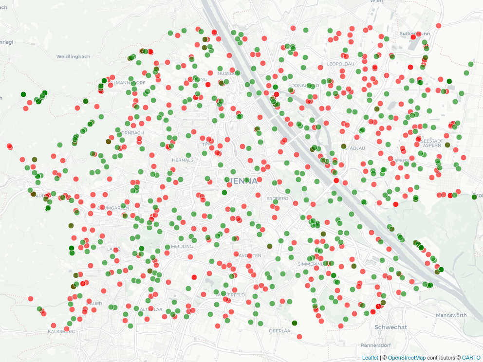
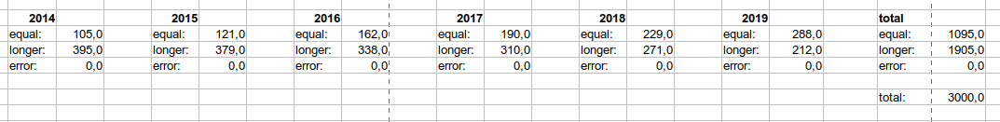
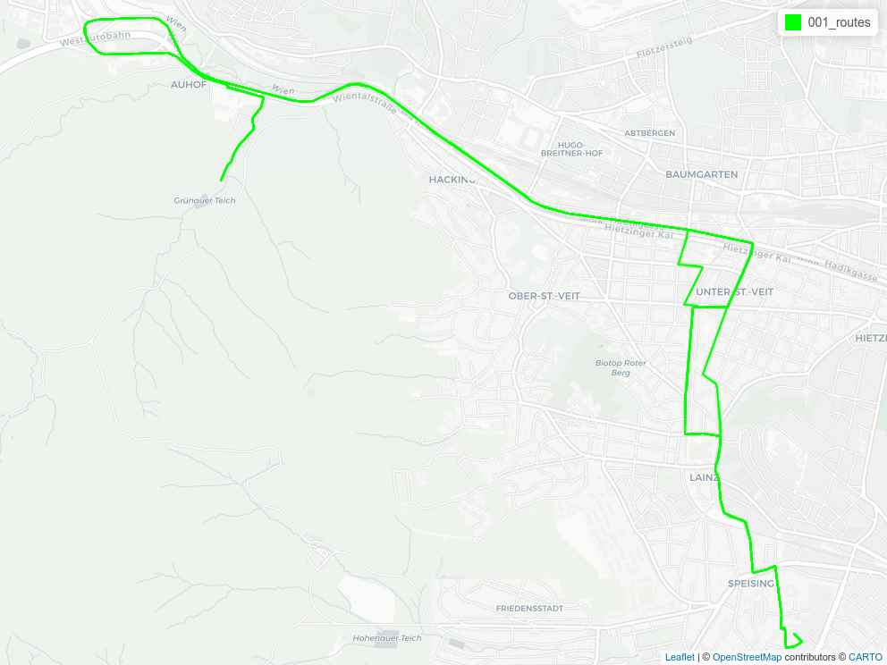

```{r setup, include=FALSE}
knitr::opts_chunk$set(echo = TRUE)

def.chunk.hook  <- knitr::knit_hooks$get("chunk")
knitr::knit_hooks$set(chunk = function(x, options) {
  x <- def.chunk.hook(x, options)
  ifelse(options$size != "normalsize", paste0("\n \\", options$size,"\n\n", x, "\n\n \\normalsize"), x)
})
```

```{r logo, eval=TRUE, echo=FALSE, message=FALSE, fig.align='center', out.width='0.3\\linewidth', fig.pos='H'}
temp <- tempfile(fileext = ".pdf")
download.file(url = "https://reproducible-agile.github.io/public/images/reproducible-AGILE-logo-square.pdf", destfile = temp)
knitr::include_graphics(temp)
```

This report is part of the reproducibility review at the AGILE conference.
For more information see [https://reproducible-agile.github.io/](https://reproducible-agile.github.io/).
This document is published on OSF at <https://osf.io/bdu28/>.
To cite the report use

> Nüst, D., & Kmoch, A. (2021, May 19). Reproducibility review of: An Approach to Assess the Effect of Currentness of Spatial Data on Routing Quality. https://doi.org/10.17605/bdu28

# Reviewed paper

> Schmidl, M., Navratil, G., and Giannopoulos, I.: An Approach to Assess the Effect of Currentness of Spatial Data on Routing Quality, AGILE GIScience Ser., 2, 13, <https://doi.org/10.5194/agile-giss-2-13-2021>, 2021.

# Summary

The reproduction was successful. All provided scripts could be execute after clarification with the authors using the provided data. Some manual steps could not be reproduced, but all code and data are shared. The script outputs match what is presented in the paper considering the randomness in the workflow. Relevant figures and tables could be recreated successfully.

# Reviewer notes

The Data and Software Availability section includes references to the OSF project <https://osf.io/rxcgj/>, which includes the experiment's data (OSM snapshots cropped to Vienna).
Out of the provided links from the DASA section, <https://geoinfo.geo.tuwien.ac.at/resources/> only provides a page with a notice "Further information will be provided soon".
Given the importance of the computational workflow for the work, the authors include extensive documentation about the implementation already in the paper.
All data and scripts seem to be available on OSF, however, there is no README, so reproduction is attempted based on the information provided in the paper _and_ the thesis the work presents, which was published after the reproducibility review began and is available at <https://doi.org/10.34726/hss.2021.33701>.
The `docker` commands below were first created by reviewer AK, and later confirmed by the documentation in the thesis.

```{r get_osf, eval=FALSE, size="scriptsize"}
# retrieve files
library("osfr")
files <- osfr::osf_ls_files(osfr::osf_retrieve_node(osfr::as_id("https://osf.io/rxcgj/")))
osfr::osf_download(files, path = here::here("019"))

# unpack
archives <- list.files(here::here("019"), recursive = TRUE, full.names = TRUE, pattern = ".zip$")
for(a in archives) {
  zip::unzip(zipfile = a, exdir = dirname(a))
}
```

An actionable environment specification for the Python code if missing, but only few libraries seem needed.
Create a Python environment to run the scripts:

```{bash env, size="tiny", eval=FALSE}
mkvirtualenv agile-019
# created virtual environment CPython3.8.5.final.0-64 in 357ms
# [..]

pip install numpy requests geojson
```

The description in the paper is a little superficial on reproducibility steps.
I tried to run the backends in Docker locally, but not in an additional VM, based on the instructions at <https://github.com/Project-OSRM/osrm-backend>.

```{bash preprocess, size="tiny", eval=FALSE}
# In local directory 019!
docker pull osrm/osrm-backend
# docker run -t -v "${PWD}/Cropped OSM data/:/data" osrm/osrm-backend osrm-extract -p /opt/car.lua /data/wien14.pbf

# Preprocessing of PBF files
for i in 14 15 16 17 18 19 20; do \
  docker run -t -v "${PWD}/Cropped OSM data/:/data" osrm/osrm-backend osrm-extract -p /opt/car.lua /data/wien${i}.pbf; \
done
for i in $(seq 14 20); do \
  docker run -t -v "${PWD}/Cropped OSM data/:/data" osrm/osrm-backend osrm-partition /data/wien${i}.osrm; \
  docker run -t -v "${PWD}/Cropped OSM data/:/data" osrm/osrm-backend osrm-customize /data/wien${i}.osrm; \
done
```

This took only a few minutes on my machine. Next is starting the routing service API.
It seems each of these Wien datasets represent a year and should be served on separate ports at the same time.

```{bash routingservices, size="tiny", eval=FALSE}
for i in $(seq 14 21); do
    docker run -t -i -d -p 50${i}:5000 -v "${PWD}/Cropped OSM data/:/data" osrm/osrm-backend osrm-routed --algorithm mld /data/wien${i}.pbf --max-matching-size 10000
done

# docker ps output:
#CONTAINER ID   IMAGE               COMMAND                  CREATED         STATUS         PORTS                                       NAMES
#9c849e607d54   osrm/osrm-backend   "osrm-routed --algor…"   2 seconds ago   Up 1 second    0.0.0.0:5020->5000/tcp, :::5020->5000/tcp   silly_payne
#9e5e6ef3b3ff   osrm/osrm-backend   "osrm-routed --algor…"   3 seconds ago   Up 2 seconds   0.0.0.0:5019->5000/tcp, :::5019->5000/tcp   quizzical_nash
#1a16b66a452c   osrm/osrm-backend   "osrm-routed --algor…"   4 seconds ago   Up 2 seconds   0.0.0.0:5018->5000/tcp, :::5018->5000/tcp   dazzling_wiles
#d4146104e3c4   osrm/osrm-backend   "osrm-routed --algor…"   4 seconds ago   Up 3 seconds   0.0.0.0:5017->5000/tcp, :::5017->5000/tcp   xenodochial_shockley
#e25d1452e69a   osrm/osrm-backend   "osrm-routed --algor…"   5 seconds ago   Up 4 seconds   0.0.0.0:5016->5000/tcp, :::5016->5000/tcp   crazy_jang
#038894e43f11   osrm/osrm-backend   "osrm-routed --algor…"   5 seconds ago   Up 4 seconds   0.0.0.0:5015->5000/tcp, :::5015->5000/tcp   priceless_margulis
#cef7c19b2396   osrm/osrm-backend   "osrm-routed --algor…"   6 seconds ago   Up 5 seconds   0.0.0.0:5014->5000/tcp, :::5014->5000/tcp   practical_bardeen

# remove all containers with:
# docker ps -a | grep osrm-backend | awk '{print($1)}' | xargs docker rm -f 
```

## Create a set of the fastest routes

Against the API calling requests, based on the Python scripts.

```{bash fastests, size="scriptsize", eval=FALSE}
# in the environment agile-019 created above
python Source\ code\ -\ Python\ scripts/01_get_routes.py
```

This only generates one `id_fastest.geojson`, but it seems 500 objects will be expected by the script `02_match_routes.py`. So I am running now:

```{bash fivehundred, size="scriptsize", eval=FALSE}
for i in $(seq -f "%03g" 0 500);  do
    echo $i;
    python Source\ code\ -\ Python\ scripts/01_get_routes.py;
    mv id_fastest.geojson ${i}_fastest.geojson;
done
```

One of the reproducibility reviewers had surprising "KeyboardInterrupt" errors. But the code seems to work in general!
A quick inspection on <http://geojson.io/> showed the created GeoJSON files are indeed routes in the city of Vienna.

### Figure 1

```{r figure1_data, size="scriptsize", cache=TRUE}
suppressPackageStartupMessages(library("sf"))
routes <- lapply(list.files(pattern = "*_fastest.geojson"), function(route_file) {
  sf::read_sf(route_file)
})

suppressPackageStartupMessages(library("lwgeom"))
starts <- sapply(routes, function(route) {
  lwgeom::st_startpoint(route["geometry"][1,])
})
starts <- st_sfc(starts)
starts <- st_set_crs(starts, 4326)
ends <- sapply(routes, function(route) {
  lwgeom::st_endpoint(route["geometry"][1,])
})
ends <- st_sfc(ends)
ends <- st_set_crs(ends, 4326)
```

```{r figure1, size="scriptsize", fig.cap="Reproduction of Figure 1: 'Distribution of the 1000 origin and destination points used in the experiment'", out.width="50%"}
suppressPackageStartupMessages(library("mapview"))
mapviewOptions(fgb = FALSE)
m <- mapview::mapview(list(starts, ends),
                      color = "white", col.regions = c("red", "green"),
                      legend = TRUE)
mapview::mapshot(m, file = "figure1.png")


```

### Table 1

A version of Table 1, naturally with different values, could be recreated from any of the generated GeoJSON files:

```{r table1}
knitr::kable(sf::read_sf("001_fastest.geojson"),
             caption = "Reproduction of Table 1")
```

## Check route completeness

This manual step was not tried to be reproduced.

## Match routes in yearly datasts to 2020 dataset

Running `02_match_routes_v2.py` first resulted in errors for both reproducibility reviewers, which could be resolved after communication with the authors.
Looking into the code, we find a line that defines the inputs, the 1001 is used to identify 001_fastest... maybe it's only for the zero padding. But it only contains 1 ID. For all 500 this could be `number_array = range(1001,1501)`, which was confirmed by the author after request for clarification.
Debugging the `match_route()` function and some searching, and the `docker run` commands in the thesis were needed to fix the error `{"message":"Too many trace coordinates","code":"TooBig"}` by adding the missing configuration parameter (see above).

With the range configuration as above, the following command creates 500 `nnn_routes.geojson` files and takes ~ 15 minutes to run.

```{bash match, size="scriptsize", eval=FALSE}
# in the environment agile-019 created above
python Source\ code\ -\ Python\ scripts/02_match_routes_v2.py
```

Now the travel times and distances are exported to a CSV file, which takes less than a minute:

```{bash summarise, size="scriptsize", eval=FALSE}
# in the environment agile-019 created above
mkdir routes
mv *_routes.geojson routes
python Source\ code\ -\ Python\ scripts/03_write_data.py
```

The resulting table contains columns for times and distances across years for all routes.

```{r route_data}
route_data <- read.csv("route_data.csv")
summary(route_data)
```
### Table 2

```{r table2, size="scriptsize"}
knitr::kable(sf::read_sf("routes/001_routes.geojson"),
             caption = "Reproduction of Table 3")
```

### Table 3

The spreadsheet document <https://osf.io/gb24w/> is used to calculate the value in Table 3. I downloaded it with the script below and then manually copy and pasted the columns starting with `time` from my own `route_data.csv` into `reproduction-route_success.ods` (uploaded next to this report) after opening the CSV file with LibreOffice Calc and replacing all `.` with `,`.

The information about "error routes" in the provided spreadsheet does not match the information in the table, it seems because the formula for detecting NA values is broken.

```{r table3ods, eval=FALSE, size="scriptsize"}
osfr::osf_download(osfr::osf_retrieve_file(as_id("https://osf.io/gb24w/")), path = here::here("019"))
```
The statistics at the bottom show a considerably smaller number for identical routes, but a similar pattern that the number of identical routes increases over the years, as shown in the screenshot below.



# Appendix Figures 

```{r figureA1, size="scriptsize", fig.cap="Reproduction of Figure A1", out.width="50%"}
`001_routes` <- sf::read_sf("routes/001_routes.geojson")
if(!file.exists("figureA1.png")) {
  mA1 <- mapview::mapview(`001_routes`,
                      color = "green")
  mapview::mapshot(mA1, file = "figureA1.png")
}

```

```{r figureA1table, size="scriptsize"}
knitr::kable(`001_routes`)
```


**Figure A2** was not reproduced as suitable sample needs to be selected manually and no map project/instructions were provided.

# Comments to the authors

- Good job storing the input data in OSF, ~~it would be helpful to have a README there though that describes how to reproduce the workflow, with precise commands and information about the to be expected data sizes and runtime of steps~~ authors added README at <https://osf.io/f9z7w/>
- Consider providing a `docker-compose` configuration for your containers
- Please consider properly citing crucial tools for your workflow next time, see https://doi.org/10.5281/zenodo.3479198 for advise
- Add a `requirements.txt` or similar with pinned versions of dependencies so others can reproduce a matching computational environment - or a `environment.yml` since you already mention Anaconda!
- Mention the used Python version in the README/docs
- Consider trying out if setting a seed makes your random process reproducible
- ~~There are many libraries for Python to create figures and maps, which facilitates automation better then Open Office or QGIS (though you can probably also script the map creation using QGIS from Python) - maybe the little R snippets in this report can help you get started if you're open to use R~~ authors updated the OSF project, see folder _Reproducibility_ in <https://osf.io/rxcgj/>, though for some figures only `.tex` files are given, but no way to generate them from data

```{r, echo=FALSE, eval=FALSE, results='hide'}
# create ZIP of reproduction files and upload to OSF
library("zip")
library("here")

zipfile <- here::here("019/reproreview-agile-2021-019.zip")
file.remove(zipfile)
zip::zipr(zipfile,
          c(here::here("019/routes"),
            list.files(here::here("019"), pattern = "*_fastest.geojson"),
            "route_data.csv",
            "reproduction-route_success.ods"))

library("osfr") # See docs at https://docs.ropensci.org/osfr/
# OSF_PAT is in .Renviron in parent directory
# We cannot use osfr to create a new component (with osfr::osf_create_component(x = osfr::osf_retrieve_node("6k5fh"), ...) because that will set the storage location to outside Europe.

# retrieve project
project <- osfr::osf_retrieve_node("bdu28")

# upload files
osfr::osf_upload(x = project,
                 conflicts = "overwrite",
                 path = c(list.files(here::here("019"),
                                     pattern = "reproreview-agile.*(pdf$|Rmd$|zip$)",
                                     full.names = TRUE)
                          )
                 )
```
