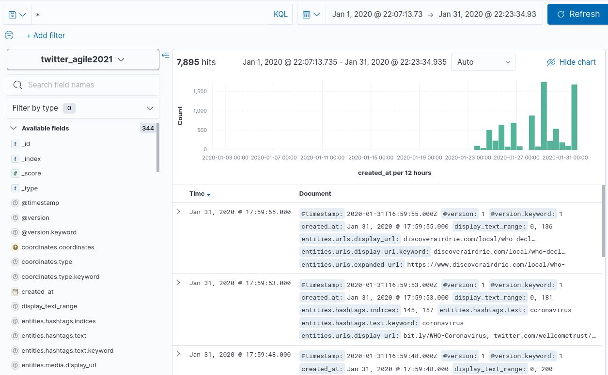
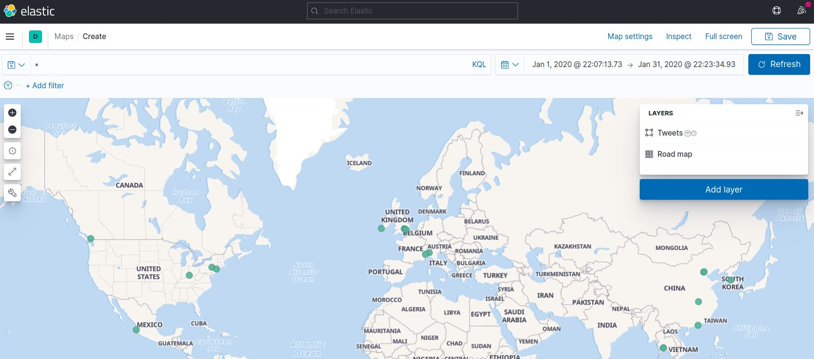

```{r setup, include=FALSE}
knitr::opts_chunk$set(echo = TRUE)

def.chunk.hook  <- knitr::knit_hooks$get("chunk")
knitr::knit_hooks$set(chunk = function(x, options) {
  x <- def.chunk.hook(x, options)
  ifelse(options$size != "normalsize", paste0("\n \\", options$size,"\n\n", x, "\n\n \\normalsize"), x)
})
```

```{r logo, eval=TRUE, echo=FALSE, message=FALSE, fig.align='center', out.width='0.3\\linewidth', fig.pos='H'}
temp <- tempfile(fileext = ".pdf")
download.file(url = "https://reproducible-agile.github.io/public/images/reproducible-AGILE-logo-square.pdf", destfile = temp)
knitr::include_graphics(temp)
```

This report is part of the reproducibility review at the AGILE conference.
For more information see [https://reproducible-agile.github.io/](https://reproducible-agile.github.io/).
This document is published on OSF at <https://osf.io/rdnyu/>.
To cite the report use

> Nüst, D. (2021, May 11). Reproducibility review of: H-TFIDF: What makes areas specific over time in the massive flow of tweets related to the covid pandemic? https://doi.org/10.17605/rdnyu

# Reviewed paper

> TODO ADD FULL CITATION

# Summary

The authors provide a well documented workflow analysing a large number of Tweets over a considerable time span.
Because of the data size, the authors provided instructions for a data subset, for which the code could be executed successfully and the created figures match the provided baseline, and also confirm that data can be created and the code is available for the results reported in the paper.

\clearpage

# Reproducibility reviewer notes

Started with the anonymous repo at <https://anonymous.4open.science/r/450b6e01-dbad-4ce4-a249-d53e88b6ff8c/README.md> I went trough the pre-requisite steps as below; in the meantime, communication with the authors happened and the review was continued based on the code repository <https://gitlab.irstea.fr/remy.decoupes/covid19-tweets-mood-tetis> which is archived to <https://doi.org/10.5281/zenodo.4742152>.

[I also started applying for an academic Twitter project to handle the large number of requests, but did not follow though.]

```{bash data, eval=FALSE, size="tiny"}
git clone https://github.com/echen102/COVID-19-TweetIDs

mkvirtualenv agile-025
pip install --upgrade twarc
twarc configure
# The credentials for nordholmen have been saved to your configuration file at /home/daniel/.twarc

# following https://github.com/echen102/COVID-19-TweetIDs#hydrating-using-twarc-cli
pip3 install tqdm

# in ./COVID-19-TweetIDs
python3 hydrate.py
```

This ran for ~ 4 hours, then threw `RecursionError: maximum recursion depth exceeded while calling a Python object`, but luckily, `hydrate.py` skips existing files, so I just restarted the process.
After several more hours, I reached out to the authors and asked for a smaller reproducible workflow.

---------

**Continue review based on de-anonymised repo [gitlab.irstea.fr/remy.decoupes/covid19-tweets-mood-tetis](https://gitlab.irstea.fr/remy.decoupes/covid19-tweets-mood-tetis).**

```{bash data2, eval=FALSE, size="tiny"}
git clone https://gitlab.irstea.fr/remy.decoupes/covid19-tweets-mood-tetis

pip3 install -r covid19-tweets-mood-tetis/requirements.txt
```

Now, I try to run the "mini reproducible workflow" described in <https://gitlab.irstea.fr/remy.decoupes/covid19-tweets-mood-tetis#run-a-mini-reproducibility-workflow-for-agile2021>.

```{bash hydrate2, eval=FALSE, size="tiny"}
cd covid19-tweets-mood-tetis/
git checkout agile-reproducibility
export PWD=$(pwd)

cd experiments/agile21/echen_input_filtred/tweets/ && python3 hydrate.py
# takes just a few minutes

mkdir hydrating-and-extracting && find . -name '*.jsonl.gz' -exec cp -prv '{}' 'hydrating-and-extracting' ';'

gunzip hydrating-and-extracting/id.jsonl.gz
```

I run the indexing and geocoding in a container as follows.
First I start Elasticsearch, following https://www.elastic.co/guide/en/elastic-stack-get-started/master/get-started-docker.html and adjusting paths and the host in `logstash-config/{json.conf,twitter_template.json}`.
The local directories are mounted into the `log01` container.

```{bash elasticsearch, eval=FALSE, size="tiny"}
docker-compose up -d

# configure Elasticsearch to not complain about only 40 GB left... https://stackoverflow.com/a/63881121/261210
curl -XPUT -H "Content-Type: application/json" http://localhost:9200/_cluster/settings -d '{ "transient": { "cluster.routing.allocation.disk.threshold_enabled": false } }'
curl -XPUT -H "Content-Type: application/json" http://localhost:9200/_all/_settings -d '{"index.blocks.read_only_allow_delete": null}'

# start a logstash container and connect it to the network with access to the required files
docker run -it --name log01 --network 025_elastic -v $(pwd)/covid19-tweets-mood-tetis/experiments:/experiments/ -v $(pwd)/covid19-tweets-mood-tetis/elasticsearch:/elasticsearch/ docker.elastic.co/logstash/logstash:7.12.1 /bin/bash

# In the container:
# 1. just checking:
# ping elasticsearch
# curl elasticsearch
# works!
# 2. install required filter
/usr/share/logstash/bin/logstash-plugin install logstash-filter-rest
#Using bundled JDK: /usr/share/logstash/jdk
#OpenJDK 64-Bit Server VM warning: Option UseConcMarkSweepGC was deprecated in version 9.0 and will likely be removed in a future release.
#Validating logstash-filter-rest
#Installing logstash-filter-rest
#Installation successful

/usr/share/logstash/bin/logstash -f /elasticsearch/logstash-config/json.conf
# started at 22:18
# [...]
#[2021-05-10T20:18:51,768][INFO ][logstash.outputs.elasticsearch][main] New Elasticsearch output {:class=>"LogStash::Outputs::ElasticSearch", :hosts=>["//elasticsearch:9200"]}
#[2021-05-10T20:18:51,891][INFO ][logstash.outputs.elasticsearch][main] Using mapping template from {:path=>"/elasticsearch/logstash-config/twitter_template.json"}
#[2021-05-10T20:18:52,020][INFO ][logstash.outputs.elasticsearch][main] Attempting to install template {:manage_template=>{"template"=>"twitter_agile2021", #"mappings"=>{"properties"=>{"created_at"=>{"type"=>"date", "format"=>"EEE MMM dd HH:mm:ss Z yyyy"}, "retweeted_status.created_at"=>{"type"=>"date", "format"=>"EEE MMM dd HH:mm:ss Z yyyy"}, #"user.created_at"=>{"type"=>"date", "format"=>"EEE MMM dd HH:mm:ss Z yyyy"}, "retweeted_status.user.created_at"=>{"type"=>"date", "format"=>"EEE MMM dd HH:mm:ss Z yyyy"}, #"coordinates.coordinates"=>{"type"=>"geo_point"}, "place.bounding_box"=>{"type"=>"geo_shape", "coerce"=>true, "ignore_malformed"=>true}, "rest_user_osm.centroid"=>{"ignore_malformed"=>true, #"type"=>"geo_point"}, "rest_user_osm.extent"=>{"ignore_malformed"=>true, "coerce"=>true, "type"=>"geo_shape"}}}}}
#[2021-05-10T20:18:52,076][INFO ][logstash.javapipeline    ][main] Starting pipeline {:pipeline_id=>"main", "pipeline.workers"=>8, "pipeline.batch.size"=>125, "pipeline.batch.delay"=>50, #"pipeline.max_inflight"=>1000, "pipeline.sources"=>["/elasticsearch/logstash-config/json.conf"], :thread=>"#<Thread:0x32cbbac8 run>"}
#[2021-05-10T20:18:52,628][INFO ][logstash.javapipeline    ][.monitoring-logstash] Pipeline Java execution initialization time {"seconds"=>2.32}
#[2021-05-10T20:18:52,725][INFO ][logstash.javapipeline    ][.monitoring-logstash] Pipeline started {"pipeline.id"=>".monitoring-logstash"}
#[2021-05-10T20:18:53,589][INFO ][logstash.javapipeline    ][main] Pipeline Java execution initialization time {"seconds"=>1.51}
#[2021-05-10T20:18:53,923][INFO ][logstash.javapipeline    ][main] Pipeline started {"pipeline.id"=>"main"}
#[2021-05-10T20:18:53,990][INFO ][logstash.agent           ] Pipelines running {:count=>2, :running_pipelines=>[:".monitoring-logstash", :main], :non_running_pipelines=>[]}
#[2021-05-10T20:18:53,997][INFO ][filewatch.observingtail  ][main][052942ba689a9111e2b06badabc82b1f2c1e15b4d38e2e18117071cffbf378e3] START, creating Discoverer, Watch with file and sincedb #collections
```

I let this run overnight and got `7985` tweets, as shown in the Figure below.

```{r screenshot1, echo=FALSE, out.width="50%", fig.align='center', fig.cap="Screenshot of Kibana after loading Tweets"}

```

The geocoding seems to have worked:

```{r screenshot2, echo=FALSE, out.width="50%", fig.align='center', fig.cap="Screenshot of Kibana: Tweet geolocation on map"}

```

Next, I try to run the _main script_:

```{bash mainscript, eval=FALSE, size="scriptsize"}
python COVID-19-TweetIDS-ES-Analyse.py
```

The scripts seems to run successfully:

```{bash,  eval=FALSE, size="tiny"}
/home/daniel/.virtualenvs/agile-025/lib/python3.8/site-packages/torch/cuda/__init__.py:52: UserWarning: CUDA initialization: Found no NVIDIA driver on your system. Please check that you have an NVIDIA GPU and installed a driver from http://www.nvidia.com/Download/index.aspx (Triggered internally at  /pytorch/c10/cuda/CUDAFunctions.cpp:100.)
  return torch._C._cuda_getDeviceCount() > 0
H-TFIDF expirements starts
Number of elasticsearch scroll: 6566
 24%|...| 1566/6566 [00:00<00:02, 2043.76it/s]
start full_text concatenation for city & day
100%|...| 335/335 [00:06<00:00, 49.42it/s]
Saving file: matrix of full_text concatenated by day & city: experiments/agile21/results/jan_2weeks_week/common/matrixAggDay.csv
Saving file: occurence of term: experiments/agile21/results/jan_2weeks_week/common/matrixOccurence.csv
H-TFIDF on: country
NumExpr defaulting to 8 threads.
H-TFIDF on: state
H-TFIDF : stop to compute for all spatial levels
Number of elasticsearch scroll: 6566
 24%|...| 1566/6566 [00:00<00:02, 2129.95it/s]
saving TF-IDF File: experiments/agile21/results/jan_2weeks_week/tf-idf-classical/tfidf_on_whole_corpus.csv
country : 466 : 0.5145610822395333 : United Kingdom
saving  TF-IDF top2117 biggest score
Number of elasticsearch scroll: 6566
 24%|...| 1566/6566 [00:00<00:02, 2190.63it/s]
saving TF-IDF File: experiments/agile21/results/jan_2weeks_week/tf-idf-classical/tfidf-tf-corpus-country/tfidf_on_Deutschland_corpus.csv
saving TF-IDF File: experiments/agile21/results/jan_2weeks_week/tf-idf-classical/tfidf-tf-corpus-country/tfidf_on_Ελλάς_corpus.csv
saving TF-IDF File: experiments/agile21/results/jan_2weeks_week/tf-idf-classical/tfidf-tf-corpus-country/tfidf_on_Беларусь_corpus.csv
saving TF-IDF File: experiments/agile21/results/jan_2weeks_week/tf-idf-classical/tfidf-tf-corpus-country/tfidf_on_België___Belgique___Belgien_corpus.csv
saving TF-IDF File: experiments/agile21/results/jan_2weeks_week/tf-idf-classical/tfidf-tf-corpus-country/tfidf_on_Norge_corpus.csv
saving TF-IDF File: experiments/agile21/results/jan_2weeks_week/tf-idf-classical/tfidf-tf-corpus-country/tfidf_on_România_corpus.csv
saving TF-IDF File: experiments/agile21/results/jan_2weeks_week/tf-idf-classical/tfidf-tf-corpus-country/tfidf_on_Türkiye_corpus.csv
saving TF-IDF File: experiments/agile21/results/jan_2weeks_week/tf-idf-classical/tfidf-tf-corpus-country/tfidf_on_Ayiti_corpus.csv
saving TF-IDF File: experiments/agile21/results/jan_2weeks_week/tf-idf-classical/tfidf-tf-corpus-country/tfidf_on_Malaysia_corpus.csv
saving TF-IDF File: experiments/agile21/results/jan_2weeks_week/tf-idf-classical/tfidf-tf-corpus-country/tfidf_on_السعودية_corpus.csv
saving TF-IDF File: experiments/agile21/results/jan_2weeks_week/tf-idf-classical/tfidf-tf-corpus-country/tfidf_on_Guyana_corpus.csv
saving TF-IDF File: experiments/agile21/results/jan_2weeks_week/tf-idf-classical/tfidf-tf-corpus-country/tfidf_on_Jersey_corpus.csv
saving TF-IDF File: experiments/agile21/results/jan_2weeks_week/tf-idf-classical/tfidf-tf-corpus-country/tfidf_on_España_corpus.csv
saving TF-IDF File: experiments/agile21/results/jan_2weeks_week/tf-idf-classical/tfidf-tf-corpus-country/tfidf_on_Azərbaycan_corpus.csv
saving TF-IDF File: experiments/agile21/results/jan_2weeks_week/tf-idf-classical/tfidf-tf-corpus-country/tfidf_on_Italia_corpus.csv
saving TF-IDF File: experiments/agile21/results/jan_2weeks_week/tf-idf-classical/tfidf-tf-corpus-country/tfidf_on_Tchad_تشاد_corpus.csv
saving TF-IDF File: experiments/agile21/results/jan_2weeks_week/tf-idf-classical/tfidf-tf-corpus-country/tfidf_on_Ecuador_corpus.csv
saving TF-IDF File: experiments/agile21/results/jan_2weeks_week/tf-idf-classical/tfidf-tf-corpus-country/tfidf_on_日本_corpus.csv
saving TF-IDF File: experiments/agile21/results/jan_2weeks_week/tf-idf-classical/tfidf-tf-corpus-country/tfidf_on_Việt_Nam_corpus.csv
saving TF-IDF File: experiments/agile21/results/jan_2weeks_week/tf-idf-classical/tfidf-tf-corpus-country/tfidf_on_Кыргызстан_corpus.csv
saving TF-IDF File: experiments/agile21/results/jan_2weeks_week/tf-idf-classical/tfidf-tf-corpus-country/tfidf_on_Eesti_corpus.csv
saving TF-IDF File: experiments/agile21/results/jan_2weeks_week/tf-idf-classical/tfidf-tf-corpus-country/tfidf_on_Danmark_corpus.csv
saving TF-IDF File: experiments/agile21/results/jan_2weeks_week/tf-idf-classical/tfidf-tf-corpus-country/tfidf_on_پاکستان_corpus.csv
saving TF-IDF File: experiments/agile21/results/jan_2weeks_week/tf-idf-classical/tfidf-tf-corpus-country/tfidf_on_नेपाल_corpus.csv
saving TF-IDF File: experiments/agile21/results/jan_2weeks_week/tf-idf-classical/tfidf-tf-corpus-country/tfidf_on_South_Africa_corpus.csv
saving TF-IDF File: experiments/agile21/results/jan_2weeks_week/tf-idf-classical/tfidf-tf-corpus-country/tfidf_on_조선민주주의인민공화국_corpus.csv
saving TF-IDF File: experiments/agile21/results/jan_2weeks_week/tf-idf-classical/tfidf-tf-corpus-country/tfidf_on_Singapore_corpus.csv
saving TF-IDF File: experiments/agile21/results/jan_2weeks_week/tf-idf-classical/tfidf-tf-corpus-country/tfidf_on_Magyarország_corpus.csv
saving TF-IDF File: experiments/agile21/results/jan_2weeks_week/tf-idf-classical/tfidf-tf-corpus-country/tfidf_on_Suomi___Finland_corpus.csv
saving TF-IDF File: experiments/agile21/results/jan_2weeks_week/tf-idf-classical/tfidf-tf-corpus-country/tfidf_on_Kenya_corpus.csv
saving TF-IDF File: experiments/agile21/results/jan_2weeks_week/tf-idf-classical/tfidf-tf-corpus-country/tfidf_on_Isle_of_Man_corpus.csv
saving TF-IDF File: experiments/agile21/results/jan_2weeks_week/tf-idf-classical/tfidf-tf-corpus-country/tfidf_on_France_corpus.csv
saving TF-IDF File: experiments/agile21/results/jan_2weeks_week/tf-idf-classical/tfidf-tf-corpus-country/tfidf_on_Slovenija_corpus.csv
saving TF-IDF File: experiments/agile21/results/jan_2weeks_week/tf-idf-classical/tfidf-tf-corpus-country/tfidf_on_Schweiz_Suisse_Svizzera_Svizra_corpus.csv
saving TF-IDF File: experiments/agile21/results/jan_2weeks_week/tf-idf-classical/tfidf-tf-corpus-country/tfidf_on_Moldova_corpus.csv
saving TF-IDF File: experiments/agile21/results/jan_2weeks_week/tf-idf-classical/tfidf-tf-corpus-country/tfidf_on_India_corpus.csv
saving TF-IDF File: experiments/agile21/results/jan_2weeks_week/tf-idf-classical/tfidf-tf-corpus-country/tfidf_on_Portugal_corpus.csv
saving TF-IDF File: experiments/agile21/results/jan_2weeks_week/tf-idf-classical/tfidf-tf-corpus-country/tfidf_on_中国_corpus.csv
saving TF-IDF File: experiments/agile21/results/jan_2weeks_week/tf-idf-classical/tfidf-tf-corpus-country/tfidf_on_Jamaica_corpus.csv
saving TF-IDF File: experiments/agile21/results/jan_2weeks_week/tf-idf-classical/tfidf-tf-corpus-country/tfidf_on_Malta_corpus.csv
saving TF-IDF File: experiments/agile21/results/jan_2weeks_week/tf-idf-classical/tfidf-tf-corpus-country/tfidf_on_Nederland_corpus.csv
saving TF-IDF File: experiments/agile21/results/jan_2weeks_week/tf-idf-classical/tfidf-tf-corpus-country/tfidf_on_Indonesia_corpus.csv
saving TF-IDF File: experiments/agile21/results/jan_2weeks_week/tf-idf-classical/tfidf-tf-corpus-country/tfidf_on_Uganda_corpus.csv
saving TF-IDF File: experiments/agile21/results/jan_2weeks_week/tf-idf-classical/tfidf-tf-corpus-country/tfidf_on_Polska_corpus.csv
saving TF-IDF File: experiments/agile21/results/jan_2weeks_week/tf-idf-classical/tfidf-tf-corpus-country/tfidf_on_Nigeria_corpus.csv
saving TF-IDF File: experiments/agile21/results/jan_2weeks_week/tf-idf-classical/tfidf-tf-corpus-country/tfidf_on_Lëtzebuerg_corpus.csv
saving TF-IDF File: experiments/agile21/results/jan_2weeks_week/tf-idf-classical/tfidf-tf-corpus-country/tfidf_on_Saint_Kitts_and_Nevis_corpus.csv
saving TF-IDF File: experiments/agile21/results/jan_2weeks_week/tf-idf-classical/tfidf-tf-corpus-country/tfidf_on_The_Bahamas_corpus.csv
saving TF-IDF File: experiments/agile21/results/jan_2weeks_week/tf-idf-classical/tfidf-tf-corpus-country/tfidf_on_Србија_corpus.csv
saving TF-IDF File: experiments/agile21/results/jan_2weeks_week/tf-idf-classical/tfidf-tf-corpus-country/tfidf_on_مصر_corpus.csv
saving TF-IDF File: experiments/agile21/results/jan_2weeks_week/tf-idf-classical/tfidf-tf-corpus-country/tfidf_on_Luzon_corpus.csv
saving TF-IDF File: experiments/agile21/results/jan_2weeks_week/tf-idf-classical/tfidf-tf-corpus-country/tfidf_on_Hrvatska_corpus.csv
saving TF-IDF File: experiments/agile21/results/jan_2weeks_week/tf-idf-classical/tfidf-tf-corpus-country/tfidf_on_Monaco_corpus.csv
saving TF-IDF File: experiments/agile21/results/jan_2weeks_week/tf-idf-classical/tfidf-tf-corpus-country/tfidf_on_Australia_corpus.csv
saving TF-IDF File: experiments/agile21/results/jan_2weeks_week/tf-idf-classical/tfidf-tf-corpus-country/tfidf_on_لبنان_corpus.csv
saving TF-IDF File: experiments/agile21/results/jan_2weeks_week/tf-idf-classical/tfidf-tf-corpus-country/tfidf_on_Sverige_corpus.csv
saving TF-IDF File: experiments/agile21/results/jan_2weeks_week/tf-idf-classical/tfidf-tf-corpus-country/tfidf_on_বাংলাদেশ_corpus.csv
saving TF-IDF File: experiments/agile21/results/jan_2weeks_week/tf-idf-classical/tfidf-tf-corpus-country/tfidf_on_Liberia_corpus.csv
saving TF-IDF File: experiments/agile21/results/jan_2weeks_week/tf-idf-classical/tfidf-tf-corpus-country/tfidf_on_Colombia_corpus.csv
saving TF-IDF File: experiments/agile21/results/jan_2weeks_week/tf-idf-classical/tfidf-tf-corpus-country/tfidf_on_မြန်မာ_corpus.csv
saving TF-IDF File: experiments/agile21/results/jan_2weeks_week/tf-idf-classical/tfidf-tf-corpus-country/tfidf_on_Україна_corpus.csv
saving TF-IDF File: experiments/agile21/results/jan_2weeks_week/tf-idf-classical/tfidf-tf-corpus-country/tfidf_on_Κύπρος_-_Kıbrıs_corpus.csv
saving TF-IDF File: experiments/agile21/results/jan_2weeks_week/tf-idf-classical/tfidf-tf-corpus-country/tfidf_on_Éire___Ireland_corpus.csv
saving TF-IDF File: experiments/agile21/results/jan_2weeks_week/tf-idf-classical/tfidf-tf-corpus-country/tfidf_on_Ghana_corpus.csv
saving TF-IDF File: experiments/agile21/results/jan_2weeks_week/tf-idf-classical/tfidf-tf-corpus-country/tfidf_on_United_Kingdom_corpus.csv
saving TF-IDF File: experiments/agile21/results/jan_2weeks_week/tf-idf-classical/tfidf-tf-corpus-country/tfidf_on_Österreich_corpus.csv
saving TF-IDF File: experiments/agile21/results/jan_2weeks_week/tf-idf-classical/tfidf-tf-corpus-country/tfidf_on_Canada_corpus.csv
saving TF-IDF File: experiments/agile21/results/jan_2weeks_week/tf-idf-classical/tfidf-tf-corpus-country/tfidf_on_New_Zealand___Aotearoa_corpus.csv
saving TF-IDF File: experiments/agile21/results/jan_2weeks_week/tf-idf-classical/tfidf-tf-corpus-country/tfidf_on_Madagasikara_corpus.csv
saving TF-IDF File: experiments/agile21/results/jan_2weeks_week/tf-idf-classical/tfidf-tf-corpus-country/tfidf_on_République_démocratique_du_Congo_corpus.csv
saving TF-IDF File: experiments/agile21/results/jan_2weeks_week/tf-idf-classical/tfidf-tf-corpus-country/tfidf_on_South_Sudan_corpus.csv
saving TF-IDF File: experiments/agile21/results/jan_2weeks_week/tf-idf-classical/tfidf-tf-corpus-country/tfidf_on_Česko_corpus.csv
saving TF-IDF File: experiments/agile21/results/jan_2weeks_week/tf-idf-classical/tfidf-tf-corpus-country/tfidf_on_Viti_corpus.csv
saving TF-IDF File: experiments/agile21/results/jan_2weeks_week/tf-idf-classical/tfidf-tf-corpus-country/tfidf_on_الإمارات_العربية_المتحدة_corpus.csv
saving TF-IDF File: experiments/agile21/results/jan_2weeks_week/tf-idf-classical/tfidf-tf-corpus-country/tfidf_on_Brasil_corpus.csv
saving TF-IDF File: experiments/agile21/results/jan_2weeks_week/tf-idf-classical/tfidf-tf-corpus-country/tfidf_on_México_corpus.csv
saving TF-IDF File: experiments/agile21/results/jan_2weeks_week/tf-idf-classical/tfidf-tf-corpus-country/tfidf_on_Slovensko_corpus.csv
saving TF-IDF File: experiments/agile21/results/jan_2weeks_week/tf-idf-classical/tfidf-tf-corpus-country/tfidf_on_United_States_corpus.csv
saving TF-IDF File: experiments/agile21/results/jan_2weeks_week/tf-idf-classical/tfidf-tf-corpus-country/tfidf_on_Argentina_corpus.csv
saving TF-IDF File: experiments/agile21/results/jan_2weeks_week/tf-idf-classical/tfidf-tf-corpus-country/tfidf_on_Gambia_corpus.csv
saving TF-IDF File: experiments/agile21/results/jan_2weeks_week/tf-idf-classical/tfidf-tf-corpus-country/tfidf_on_السودان_corpus.csv
saving TF and TF-IDF top500 biggest score
Retrieve frequent terms per country
saving file: experiments/agile21/results/jan_2weeks_week/common/most_frequent_terms_by_country.csv
\begin{tabular}{lll}
\toprule
      H-TFIDF &             TF-IDF & Frequent terms \\
\midrule
        china &  \#2019ncoronavirus &    coronavirus \\
        apple &             \#apple &          china \\
        virus &         \#australia &       outbreak \\
       huawei &          \#business &          virus \\
 \#coronavirus &         \#buyapaper &   \#coronavirus \\
        wuhan &        \#chinavirus &         people \\
      closely &           \#chinazi &          wuhan \\
         just &           \#chinese &        chinese \\
   monitoring &    \#chinesenewyear &           just \\
  coronavirus &     \#coronaravirus &          cases \\
       people &     \#coronarovirus &           like \\
       \#china &       \#coronavirus &           news \\
   technology &     \#coronavirusuk &         health \\
      chinese &       \#coronovirus &         spread \\
         hope &           \#finance &         deadly \\
\bottomrule
\end{tabular}

Load pretrained SentenceTransformer: distilbert-base-nli-mean-tokens
Did not find folder distilbert-base-nli-mean-tokens
Try to download model from server: https://sbert.net/models/distilbert-base-nli-mean-tokens.zip
Downloading sentence transformer model from https://sbert.net/models/distilbert-base-nli-mean-tokens.zip and saving it at /home/daniel/.cache/torch/sentence_transformers/sbert.net_models_distilbert-base-nli-mean-tokens
100%|...| 245M/245M [00:13<00:00, 18.7MB/s]
Load SentenceTransformer from folder: /home/daniel/.cache/torch/sentence_transformers/sbert.net_models_distilbert-base-nli-mean-tokens
Use pytorch device: cpu
Batches: 100%|...| 68/68 [00:21<00:00,  3.20it/s]
file: experiments/agile21/results/jan_2weeks_week/tsne/tsne_bert-embeddings_TF-IDF on corpus by Country has been saved.
Load pretrained SentenceTransformer: distilbert-base-nli-mean-tokens
Did not find folder distilbert-base-nli-mean-tokens
Try to download model from server: https://sbert.net/models/distilbert-base-nli-mean-tokens.zip
Load SentenceTransformer from folder: /home/daniel/.cache/torch/sentence_transformers/sbert.net_models_distilbert-base-nli-mean-tokens
Use pytorch device: cpu
Batches: 100%|...| 91/91 [00:29<00:00,  3.06it/s]
file: experiments/agile21/results/jan_2weeks_week/tsne/tsne_bert-embeddings_H-TFIDF has been saved.
post-traitement flooding on: country
/home/daniel/.virtualenvs/agile-025/lib/python3.8/site-packages/tqdm/std.py:668: FutureWarning: The Panel class is removed from pandas. Accessing it from the top-level namespace will also be removed in the next version
  from pandas import Panel
100%|...| 60000/60000 [01:44<00:00, 575.91it/s]
post-traitement flooding on: state
100%|...| 80500/80500 [01:22<00:00, 979.81it/s]
Load pretrained SentenceTransformer: distilbert-base-nli-mean-tokens
Did not find folder distilbert-base-nli-mean-tokens
Try to download model from server: https://sbert.net/models/distilbert-base-nli-mean-tokens.zip
Load SentenceTransformer from folder: /home/daniel/.cache/torch/sentence_transformers/sbert.net_models_distilbert-base-nli-mean-tokens
Use pytorch device: cpu
Impossible to cluster for countrywith method: kmeans
Load pretrained SentenceTransformer: distilbert-base-nli-mean-tokens
Did not find folder distilbert-base-nli-mean-tokens
Try to download model from server: https://sbert.net/models/distilbert-base-nli-mean-tokens.zip
Load SentenceTransformer from folder: /home/daniel/.cache/torch/sentence_transformers/sbert.net_models_distilbert-base-nli-mean-tokens
Use pytorch device: cpu
Impossible to cluster for countrywith method: kmeans
Load pretrained SentenceTransformer: distilbert-base-nli-mean-tokens
Did not find folder distilbert-base-nli-mean-tokens
Try to download model from server: https://sbert.net/models/distilbert-base-nli-mean-tokens.zip
Load SentenceTransformer from folder: /home/daniel/.cache/torch/sentence_transformers/sbert.net_models_distilbert-base-nli-mean-tokens
Use pytorch device: cpu
Impossible to cluster for countrywith method: kmeans
Load pretrained SentenceTransformer: distilbert-base-nli-mean-tokens
Did not find folder distilbert-base-nli-mean-tokens
Try to download model from server: https://sbert.net/models/distilbert-base-nli-mean-tokens.zip
Load SentenceTransformer from folder: /home/daniel/.cache/torch/sentence_transformers/sbert.net_models_distilbert-base-nli-mean-tokens
Use pytorch device: cpu
Impossible to cluster for countrywith method: kmeans
Load pretrained SentenceTransformer: distilbert-base-nli-mean-tokens
Did not find folder distilbert-base-nli-mean-tokens
Try to download model from server: https://sbert.net/models/distilbert-base-nli-mean-tokens.zip
Load SentenceTransformer from folder: /home/daniel/.cache/torch/sentence_transformers/sbert.net_models_distilbert-base-nli-mean-tokens
Use pytorch device: cpu
Batches: 100%|...| 27/27 [00:07<00:00,  3.71it/s]
file experiments/agile21/results/jan_2weeks_week/country/clustering/United Kingdom_kmeans.json has been saved
Load pretrained SentenceTransformer: distilbert-base-nli-mean-tokens
Did not find folder distilbert-base-nli-mean-tokens
Try to download model from server: https://sbert.net/models/distilbert-base-nli-mean-tokens.zip
Load SentenceTransformer from folder: /home/daniel/.cache/torch/sentence_transformers/sbert.net_models_distilbert-base-nli-mean-tokens
Use pytorch device: cpu
Impossible to cluster for countrywith method: agglomerative_clustering
Load pretrained SentenceTransformer: distilbert-base-nli-mean-tokens
Did not find folder distilbert-base-nli-mean-tokens
Try to download model from server: https://sbert.net/models/distilbert-base-nli-mean-tokens.zip
Load SentenceTransformer from folder: /home/daniel/.cache/torch/sentence_transformers/sbert.net_models_distilbert-base-nli-mean-tokens
Use pytorch device: cpu
Impossible to cluster for countrywith method: agglomerative_clustering
Load pretrained SentenceTransformer: distilbert-base-nli-mean-tokens
Did not find folder distilbert-base-nli-mean-tokens
Try to download model from server: https://sbert.net/models/distilbert-base-nli-mean-tokens.zip
Load SentenceTransformer from folder: /home/daniel/.cache/torch/sentence_transformers/sbert.net_models_distilbert-base-nli-mean-tokens
Use pytorch device: cpu
Impossible to cluster for countrywith method: agglomerative_clustering
Load pretrained SentenceTransformer: distilbert-base-nli-mean-tokens
Did not find folder distilbert-base-nli-mean-tokens
Try to download model from server: https://sbert.net/models/distilbert-base-nli-mean-tokens.zip
Load SentenceTransformer from folder: /home/daniel/.cache/torch/sentence_transformers/sbert.net_models_distilbert-base-nli-mean-tokens
Use pytorch device: cpu
Impossible to cluster for countrywith method: agglomerative_clustering
Load pretrained SentenceTransformer: distilbert-base-nli-mean-tokens
Did not find folder distilbert-base-nli-mean-tokens
Try to download model from server: https://sbert.net/models/distilbert-base-nli-mean-tokens.zip
Load SentenceTransformer from folder: /home/daniel/.cache/torch/sentence_transformers/sbert.net_models_distilbert-base-nli-mean-tokens
Use pytorch device: cpu
Batches: 100%|...| 27/27 [00:07<00:00,  3.51it/s]
file experiments/agile21/results/jan_2weeks_week/country/clustering/United Kingdom_agglomerative_clustering.json has been saved
Load pretrained SentenceTransformer: distilbert-base-nli-mean-tokens
Did not find folder distilbert-base-nli-mean-tokens
Try to download model from server: https://sbert.net/models/distilbert-base-nli-mean-tokens.zip
Load SentenceTransformer from folder: /home/daniel/.cache/torch/sentence_transformers/sbert.net_models_distilbert-base-nli-mean-tokens
Use pytorch device: cpu
Batches: 0it [00:00, ?it/s]
Impossible to cluster for statewith method: kmeans
Load pretrained SentenceTransformer: distilbert-base-nli-mean-tokens
Did not find folder distilbert-base-nli-mean-tokens
Try to download model from server: https://sbert.net/models/distilbert-base-nli-mean-tokens.zip
Load SentenceTransformer from folder: /home/daniel/.cache/torch/sentence_transformers/sbert.net_models_distilbert-base-nli-mean-tokens
Use pytorch device: cpu
Impossible to cluster for statewith method: kmeans
Load pretrained SentenceTransformer: distilbert-base-nli-mean-tokens
Did not find folder distilbert-base-nli-mean-tokens
Try to download model from server: https://sbert.net/models/distilbert-base-nli-mean-tokens.zip
Load SentenceTransformer from folder: /home/daniel/.cache/torch/sentence_transformers/sbert.net_models_distilbert-base-nli-mean-tokens
Use pytorch device: cpu
Batches: 0it [00:00, ?it/s]
Impossible to cluster for statewith method: agglomerative_clustering
Load pretrained SentenceTransformer: distilbert-base-nli-mean-tokens
Did not find folder distilbert-base-nli-mean-tokens
Try to download model from server: https://sbert.net/models/distilbert-base-nli-mean-tokens.zip
Load SentenceTransformer from folder: /home/daniel/.cache/torch/sentence_transformers/sbert.net_models_distilbert-base-nli-mean-tokens
Use pytorch device: cpu
Impossible to cluster for statewith method: agglomerative_clustering
Can't build venn for: Deutschland
Can't build venn for: España
Can't build venn for: France
Can't build venn for: Italia
H-TFIDF expirements stops
```

The script also created some output files in `experiments/agile21/results/jan_2weeks_week/`, including some figures (see below), which match the ones mentioned in the README for the reduced workflow with small changes that can be explained due to the non-deterministic creation of the test dataset.

```{r, echo=FALSE, out.width="50%", fig.align='center', fig.cap="Venn diagramm per week for UK, file covid19-tweets-mood-tetis/experiments/agile21/results/jan\\_2weeks\\_week/venn/venn\\_United Kingdom.png"}
knitr::include_graphics("covid19-tweets-mood-tetis/experiments/agile21/results/jan_2weeks_week/venn/venn_United Kingdom.png")
```

```{r, echo=FALSE, out.width="50%", fig.align='center', fig.cap="Reproduction of Figure 3 (only one of two weeks). Wordcloud of H-TFIDF terms; file covid19-tweets-mood-tetis/experiments/agile21/results/jan\\_2weeks\\_week/country/wordcloud/United\\_Kingdom\\_2020-01-19.png¸"}
knitr::include_graphics("covid19-tweets-mood-tetis/experiments/agile21/results/jan_2weeks_week/country/wordcloud/United_Kingdom_2020-01-19.png")
```

```{r, echo=FALSE, out.width="50%", fig.align='center', fig.cap="Reproduction of Figure 4. Common  terms  between  H-TFIDF,  TF-IDF  and most frequent terms for United Kingdom in the last week of February; file covid19-tweets-mood-tetis/experiments/agile21/results/jan\\_2weeks\\_week/common/most\\_frequent\\_terms\\_by\\_country\\_United 0Kingdomvenn3.png"}
knitr::include_graphics("covid19-tweets-mood-tetis/experiments/agile21/results/jan_2weeks_week/common/most_frequent_terms_by_country_United Kingdomvenn3.png")
```

```{r, echo=FALSE, out.width="50%", fig.align='center', fig.cap="Reproduction of Figure 5 (only top 100 terms). Comparison of percentage of common words between H-TFIDF or TF-IDF with the most frequent terms per country; file covid19-tweets-mood-tetis/experiments/agile21/results/jan\\_2weeks\\_week/common/most\\_frequent\\_terms\\_by\\_country\\_100.png"}
knitr::include_graphics("covid19-tweets-mood-tetis/experiments/agile21/results/jan_2weeks_week/common/most_frequent_terms_by_country_100.png")
```

```{r, echo=FALSE, out.width="50%", fig.align='center', fig.cap="Reproduction of Figure 6a. Projection of H-TFIDF representation in a t-SNE space; file covid19-tweets-mood-tetis/experiments/agile21/results/jan\\_2weeks\\_week/tsne/tsne\\_bert-embeddings\\_H-TFIDF.png"}
knitr::include_graphics("covid19-tweets-mood-tetis/experiments/agile21/results/jan_2weeks_week/tsne/tsne_bert-embeddings_H-TFIDF.png")
```

```{r, echo=FALSE, out.width="50%", fig.align='center', fig.cap="Reproduction of Figure 6b. Projection of TF-IDF representation in a t-SNE space; file covid19-tweets-mood-tetis/experiments/agile21/results/jan\\_2weeks\\_week/tsne/tsne\\_bert-embeddings\\_TF-IDF on corpus by Country.png"}
knitr::include_graphics("covid19-tweets-mood-tetis/experiments/agile21/results/jan_2weeks_week/tsne/tsne_bert-embeddings_TF-IDF on corpus by Country.png")
```

These figures resemble the ones in the paper using the full dataset.
Therefore, I am confident the code and data underlying the analysis of the paper are available (or can be created) with the files shared in the repository.
The authors provide detailed documentation for a pretty complex workflow.

The changes made to the configuration (e.g., to make it work with my container setup) using the `agile-reproducibility` branch of the repository are saved to a diff-file published alongside this document and the code is forked to the [Reproducible AGILE GitLab organisation](https://gitlab.com/reproducible-agile/reviews/covid19-tweets-mood-tetis).

```{bash, echo=FALSE}
cd covid19-tweets-mood-tetis/
git diff --ignore-all-space > ../repro-review.diff
```

# Comments to the authors

- Good job using anonymous.4open.science in the original submission!
- I don't really like the solution to put the small reproducible workflow into a branch - this means that the example code will digress from the original workflow and will at some point be likely to break; I'd prefer to have a subdirectory, ideally you package the reusable parts of the workflow in a proper Python package
- Maybe the docker-compose configuration shared with this review is useful to you - it would be great if you could come a bit closer to a "one click reproduction" with the help of containers, e.g., the steps that I did for logstash could also be automated with the help of a Dockerfile
- ~~Please add information to the README regarding data sizes and expected runtimes! When I started cloning the Echen repo, I did not expect to download gigabytes of data.~~ authors updated the README
- ~~Please provide clear usage instructions in the README, including a list of table mapping scripts/commands to each figure in the manuscript (How can I recreate Figure x?)~~ authors updated the README
- ~~You can also add repository from GitHub in your own `requirements.txt` file and make installation of twarc easier, see https://stackoverflow.com/a/35998253/261210~~ changed by authors
- A more suitable page for installing twarc would be https://twarc-project.readthedocs.io/en/latest/
- Please provide direct links to installation instructions for the ELK stack - IMO a ready-to-use `docker-compose` configuration would be a good idea, the one I used is published in the reproduction material; also, specify the Elasticsearch version that you used.
- CeCILL-B free software license agreement uncommon, if possible use more generally known and understood licenses (I understand this choice might be out of your control); note that the license actually partly deanonymises you

```{r, echo=FALSE, eval=FALSE, results='hide'}
# create ZIP of reproduction files and upload to OSF
library("zip")
library("here")

zipfile <- here::here("025/agile-reproreview-2021-025.zip")
file.remove(zipfile)
zip::zipr(zipfile,
          c(
            here::here("025/docker-compose.yml"),
            here::here("025/repro-review.diff"),
            here::here("025/tweet-map.jpg"),
            here::here("025/tweet-count.jpg")))

library("osfr") # See docs at https://docs.ropensci.org/osfr/
# OSF_PAT is in .Renviron in parent directory
# We cannot use osfr to create a new component (with osfr::osf_create_component(x = osfr::osf_retrieve_node("6k5fh"), ...) because that will set the storage location to outside Europe.

# retrieve project
project <- osfr::osf_retrieve_node("rdnyu")

# upload files
osfr::osf_upload(x = project,
                 conflicts = "overwrite",
                 path = c(list.files(here::here("PATH"),
                                     pattern = "agile-reproreview-.*(pdf$|Rmd$|zip$)",
                                     full.names = TRUE),
                          "COPYRIGHT"
                          )
                 )
```