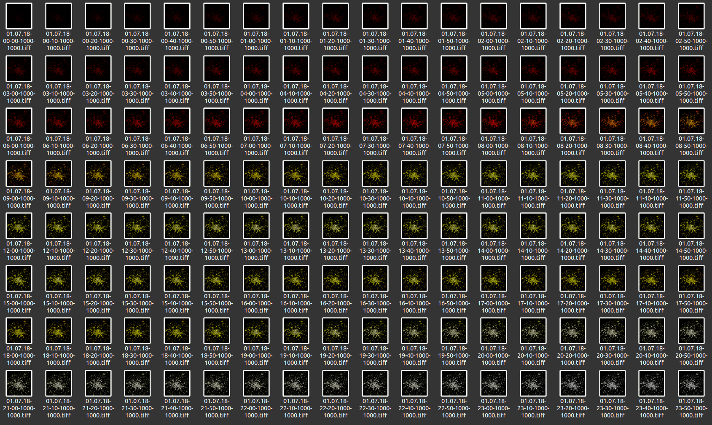

```{r setup, include=FALSE}
knitr::opts_chunk$set(echo = TRUE, eval = FALSE)

def.chunk.hook  <- knitr::knit_hooks$get("chunk")
knitr::knit_hooks$set(chunk = function(x, options) {
  x <- def.chunk.hook(x, options)
  ifelse(options$size != "normalsize", paste0("\n \\", options$size,"\n\n", x, "\n\n \\normalsize"), x)
})
```

```{r logo, eval=TRUE, echo=FALSE, message=FALSE, fig.align='center', out.width='0.3\\linewidth', fig.pos='H'}
temp <- tempfile(fileext = ".pdf")
download.file(url = "https://reproducible-agile.github.io/public/images/reproducible-AGILE-logo-square.pdf", destfile = temp)
knitr::include_graphics(temp)
```

This report is part of the reproducibility review at the AGILE conference.
For more information see [https://reproducible-agile.github.io/](https://reproducible-agile.github.io/).
This document is published on OSF at [https://osf.io/5svmt/](https://osf.io/5svmt/).
To cite the report use

>  _Nüst, Daniel, and Carlos Granell (2020). What to do in the Meantime: A Service Coverage Analysis for Parked Autonomous Vehicles. https://doi.org/10.17605/OSF.IO/5SVMT _

# Reviewed paper

> _Steffen Illium, Philipp Friese, Robert Müller and Sebastian Feld: What to do in the meantime: An Service Coverage Analysis for Parked Autonomous Vehicles. AGILE GiScience Ser., 1, 6. https://doi.org/10.5194/agile-giss-1-6-2020, 2020._

# Summary

The paper data and code were published on OSF at [10.17605/OSF.IO/PWYJN](https://doi.org/10.17605/OSF.IO/PWYJN) under an open license.
With some directions from the authors extending on the published documentation and a considerable trial and error process, we were able to confirm the executability of the provided code.
Two figures from the paper could be recreated based on a subsampled dataset.
_The reproduction was partially successful_.

\clearpage

# Reproducibility reviewer notes

The paper contains an a Data and Software Availability section and a link to an OSF project with data, code, and a README file.
The main analysis code seems to be in Python with the environment specified in the file `reachability-python/requirements.txt`.

From a direct contact with the authors, we learned that 

- Figure 1 was done using an external GIS tool based on the data in the database
- Figure 2 is generated based on the provided data and software with the command is listed in "Execute Analysis - Overview Visualization" (function `visualizeOverview(…)`, line 106 in `main.py`), using the function parameter `write_out=True` to get an image and a CSV file containing the analysed data
- Figure 3 was generated using the "Raster Visualization" procedure, which generates the images
- Figure 4 cannot be reproduced because it requires personalised protected data

**Therefore, we focused on recreation of Figures 2 and 3.**

For the execution, we used a virtual environment and installed the dependencies.

```{bash environment}
mkvirtualenv reproreview-agile-009

pip install -r reachability-python/requirements.txt
```

Then we followed the instructions for building and running the database container and continued with the analysis execution.
We could start the commands given in the README without error, but did not wait for the processing to finish, but aborted and ran the commands for a single day only, which still had an execution time of over one day.
After these initial tests we found the execution time, even selecting only specific days, to be much too long for the purpose of this reproduction.
Furthermore, we encountered considerable challenges to execute the workflow on a Windows computer using the provided instructions, so that the reproducibility reviewer had to be changed (see below for more information).

Further information from the authors pointed out the possibility to _sample the dataset_.
To achieve this, some changes to the `main.py` script were made, as pointed out be the authors:

> _Another idea may be to sample the dataset. This may be done via 'df_agents_parking = df_agents_parking.sample(frac=0.5)' on line 61 to sample for 50%. 
The results should provide insight into our algorithm and the provided dataset, although it will naturally not match the concrete numbers of our presented findings._
> _If you decide to sample from the dataset, it may be advisable to remove the line 'ax.set_ylim(250,900)' on visualizer.py:336. This limit was used to generate consistent axes, but these hardcoded numbers will not match a sampled dataset.
Please also note that the colormap of our rastered images are based on the minimum and maximum number of available vehicles of the analyzed dataset. Therefore the colormap will not match the one shown in our paper; a white pixel will not represent about 900 vehicles, but fewer depending on the sampled dataset._

We found the sampling to considerable reduce computation time to a few hours per day of data (8 cores, 40 GB RAM, SSD).
The authors also pointed out that the output of the `generateNodes` function (`analyzer.py:157+`) does write out the result, but does not reload from disk and instead recomputes on each invocation.
In the process of reducing execution time, we therefore extended the script `main.py` to properly check if nodes were already calculated.
See below for the changes made to the files, which are included in the report's repository.

The remaining code uses a sample of the data with `frac=0.1`.
I required some trial and error, because smaller fractions (`.05`, `.01`) seemingly did not provide enough data for the visualisation and resulted in an error.

```{bash traceback, size="tiny"}
Traceback (most recent call last):
  File "computational-workflow/reachability-python/src/main.py", line 112, in <module>
    visualizeOverview(timeslices, args.imagePath, startDate, endDate, write_out=True)
  File "/home/daniel/git/reproducible-agile/reviews-2020/reports/2020-009/computational-workflow/reachability-python/src/visualizer.py", line 319, in visualizeOverview
    meanAgents = int(np.mean(meanAgents))
ValueError: cannot convert float NaN to integer
```

```{bash generate, size="tiny"}
python computational-workflow/reachability-python/src/main.py --csvPath=dataset/df_parking.csv --analysisType='generateTimeslices'
visualizer.py:25 2020-07-09 22:21:06,533 E - Error No module named 'osgeo' occured while importing osgeo 
main.py:86 2020-07-09 22:21:07,264 I - Generating timeslices from 2018-07-01 to 2018-07-09 
analyzer.py:169 2020-07-09 22:21:07,264 I - Will generate nodes from 2018-07-01 00:00:00+02:00 to 2018-07-02 00:00:00+02:00, saving nodes to
  ./nodes/nodes-01.07.18-02.07.18.pkl.xz 
analyzer.py:175 2020-07-09 22:21:07,264 I - Generating Nodes 
analyzer.py:91 2020-07-09 22:21:07,264 I - Calculating timeslices for 2190 entries 
analyzer.py:135 2020-07-09 22:21:07,264 D - Dispatching timeslicedIsochrones jobs to pool 
analyzer.py:136 2020-07-09 22:21:07,264 I - Starting calculation at 09.07.20 22:21:07 
Running for: 2:30:12.930200, finishing in 2:30:12.930200 at: 10.07.20 00:51:20 | Current calculation took 0:00:06.846044                   
analyzer.py:180 2020-07-10 00:51:55,391 D - Dumped nodes to ./nodes/nodes-01.07.18-02.07.18.pkl.xz 
exporter.py:59 2020-07-10 00:51:55,397 I - Exporting nodes between 01.07.18 - 02.07.18 
cacher.py:30 2020-07-10 00:51:55,397 I - Did not find valid cache for exported-timeslices-01.07.18-02.07.18, will use callback 

analyzer.py:169 2020-07-10 00:54:19,409 I - Will generate nodes from 2018-07-02 00:00:00+02:00 to 2018-07-03 00:00:00+02:00, saving nodes to 
  ./nodes/nodes-02.07.18-03.07.18.pkl.xz 
analyzer.py:175 2020-07-10 00:54:19,409 I - Generating Nodes 
analyzer.py:91 2020-07-10 00:54:19,409 I - Calculating timeslices for 2190 entries 
analyzer.py:135 2020-07-10 00:54:19,410 D - Dispatching timeslicedIsochrones jobs to pool 
analyzer.py:136 2020-07-10 00:54:19,410 I - Starting calculation at 10.07.20 00:54:19 
Running for: 2:41:58.662980, finishing in 2:41:58.662980 at: 10.07.20 03:36:18 | Current calculation took 0:00:00.793759                   
analyzer.py:180 2020-07-10 03:36:53,777 D - Dumped nodes to ./nodes/nodes-02.07.18-03.07.18.pkl.xz 
exporter.py:59 2020-07-10 03:36:56,483 I - Exporting nodes between 02.07.18 - 03.07.18 
cacher.py:30 2020-07-10 03:36:56,484 I - Did not find valid cache for exported-timeslices-02.07.18-03.07.18, will use callback 

analyzer.py:169 2020-07-10 03:39:24,679 I - Will generate nodes from 2018-07-03 00:00:00+02:00 to 2018-07-04 00:00:00+02:00, saving nodes to 
  ./nodes/nodes-03.07.18-04.07.18.pkl.xz 
analyzer.py:175 2020-07-10 03:39:24,680 I - Generating Nodes 
analyzer.py:91 2020-07-10 03:39:24,680 I - Calculating timeslices for 2190 entries 
analyzer.py:135 2020-07-10 03:39:24,680 D - Dispatching timeslicedIsochrones jobs to pool 
analyzer.py:136 2020-07-10 03:39:24,680 I - Starting calculation at 10.07.20 03:39:24 
Running for: 3:12:04.140724, finishing in 3:12:04.140724 at: 10.07.20 06:51:28 | Current calculation took 0:00:23.490000                   
analyzer.py:180 2020-07-10 06:52:09,870 D - Dumped nodes to ./nodes/nodes-03.07.18-04.07.18.pkl.xz 
exporter.py:59 2020-07-10 06:52:12,233 I - Exporting nodes between 03.07.18 - 04.07.18 
cacher.py:30 2020-07-10 06:52:12,233 I - Did not find valid cache for exported-timeslices-03.07.18-04.07.18, will use callback

[... processing aborted.]
```

For the next command to succeed, I had to manually create the `images` directory, otherwise there was an error saving the CSV file.

```{bash visualise, size="tiny"}
python computational-workflow/reachability-python/src/main.py --csvPath=dataset/df_parking.csv --analysisType='visualizeOverview' --day='01.07.18'
visualizer.py:25 2020-07-10 09:32:31,483 E - Error No module named 'osgeo' occured while importing osgeo 
03.07.18
main.py:97 2020-07-10 09:32:32,225 I - Visualizing overview at 2018-07-03 00:00:00+02:00 
main.py:103 2020-07-10 09:32:32,225 I - Loading nodes from ./nodes/nodes-03.07.18-04.07.18.pkl.xz 
exporter.py:59 2020-07-10 09:32:36,745 I - Exporting nodes between 03.07.18 - 04.07.18 
cacher.py:24 2020-07-10 09:32:36,745 I - Found valid cache for exported-timeslices-03.07.18-04.07.18 at ./caches/exported-timeslices-03.07.18-04.07.18-1594356805.xz 
visualizer.py:320 2020-07-10 09:33:10,051 D - Minimum agents at one spot: 200, mean agents: 345, maximum agents: 492
```

This created the file `images/analysis-01.07.18-02.07.18.png` shown below, which seems seems to loosely match (to be expected due to sampling) a panel of Fig. 2.
Confusing is that the created plots is labeled as "vehicles seamlessly reaching one vertex", whereas the Fig. 2 is described in the text as "vehicles reaching all available vertices".


Another plot I created during testing is `images/analysis-03.07.18-04.07.18.png`, shown below.


Plots only took a minute to render, judging from the logs largely due to loading the nodes.

------

The "rasterize" step failed at first. When deactivating multiprocessing, I got an error message about missing `ogr`, and found that the `requirements.txt` file does not install a GDAL library.
I added the following to the environment specification, matching my system's GDAL version.
This also fixed the "No module named 'osgeo'" error in the executions above.

```
pygdal == 3.0.4.6
```

Then the command works.

```{bash execution, size="tiny"}
$ python computational-workflow/reachability-python/src/main.py --csvPath=dataset/df_parking.csv --analysisType='rasterizeTimeslices' --day='01.07.18'
01.07.18
main.py:134 2020-07-10 10:01:11,456 I - Generating rasters at 2018-07-01 00:00:00+02:00 
main.py:140 2020-07-10 10:01:11,457 I - Loading nodes from ./nodes/nodes-01.07.18-02.07.18.pkl.xz 
exporter.py:59 2020-07-10 10:01:17,029 I - Exporting nodes between 01.07.18 - 02.07.18 
cacher.py:24 2020-07-10 10:01:17,030 I - Found valid cache for exported-timeslices-01.07.18-02.07.18 at 
   ./caches/exported-timeslices-01.07.18-02.07.18-1594335175.xz 
visualizer.py:136 2020-07-10 10:01:53,579 I - Rasterizing timeslices 
visualizer.py:173 2020-07-10 10:01:54,236 I - Starting processing (multiprocessing: False) 
Rendering timeslices [##########] (23 50)
```

This created a directory `images/images-01.07.18` with one file per ten minute interval of the analysed day.

```{bash rasterfiles, size="scriptsize"}
/images/images-01.07.18 [master]$ ls
01.07.18-00-00-1000-1000.tiff  01.07.18-04-50-1000-1000.tiff  
01.07.18-09-40-1000-1000.tiff  01.07.18-14-30-1000-1000.tiff  
01.07.18-19-20-1000-1000.tiff  01.07.18-00-10-1000-1000.tiff
[...]
```

Here is a screenshot of the directory with previews of the created plots.
The plots are from a different day than in the paper, but closely resemble what is displayed in Fig. 6.



# Comments to the authors

The README.md provides reasonable instructions for reproducing the workflow.
I briefly skimmed over the script files, and find them readable and well formatted.
I found your documentation and notes on the files contained in your project helpful.
However, I am not sure about the contents of the `pg_database` directory.
To me it would have been more useful to provide the dataset in an open format that is _not_ specific to Postgres, even if an additional step for importing is needed.

I really liked that you document the expected results of instructions ("should not include the directory..") and explain commands that can be unclear (".. hence the use of pwd").
The fact that the cache is not used for the visualization is a bug, and without your input via email, the reproduction would have failed.

Overall: solid job, it was great to eventually be able to reproduce the workflow and I am glad we put in the effort to get there.
However, for future work, I _strongly_ recommend you build in and document how to run a small subset in short time, and that you spend the extra efforts to compose your figures with code.

I have the following concrete recommendations:

- After you have created your "package", follow your on instructions in an "empty" workspace, e.g. a virtual machine, to catch missing steps
- Regarding the workflow: it was confusing that the "visualize" step would re-execute the "generate timeslices" step; suggest to cleanly seperate steps in the pipeline, ideally use a pipeline management tool to handle caching of intermediate results and execution control
- A fellow reproducibility reviewer had a hard time reproducing the workflow based on a Windows machine, until I took over; please consider documenting the platform on which the workflow was tested (probably Linux) and the expected execution times based on your experiences on your hardware.
- Use unique names for environments/containers in your instructions - I am pretty sure I will not know what the `docker-posgres` Docker container was for in a few weeks.
- If you use Docker's `--file` option you can run all commands from the same directory (`cd ..` can be confusing for non-Linux users)
- You could extend on the 'to be expected outputs' documentation to other commands, e.g., when starting the Docker container I should see "database system is ready..", assuming no knowledge of Docker or Python by your readers
- Provide clear documentation which part of the workflow creates which figure, as you provided to CG via email
- Provide the GIS configuration files used to create maps, or use scripts to create the maps, for even better reproducibility
- Finally, maybe the analysis does not make sense, but the option to slice down to just an hour of a day would have been really great to see if the code runs without waiting so long
- Since you provide the option to run just for parts of the data, please include the example output for such a subset, so a reader knows if their reproduction yielded the expected result
- Consider including intermediate datasets if execution times are longer than a few minutes
- Have a script to create multi-panel figures, such as Fig. 2
- Use the same date format for log outputs and parameter inputs (really, why use anything else than `YYYY-MM-DD`?); and use dates in the article, not just weekdays (unless you use weekdays in logs and parameters, too)
- Avoid the use of footnotes (URL only) to point software, and use otherwise full citation according to well-known practices to cite software products, packages or libraries. 

## Windows-based review

The paper code and datasets were published in an [OSF project](https://osf.io/evxh9/).
The OSF project included a README file with installation instructions on a linux-based machine, and code snippets to produce some of the figures in the paper.

Reproduction (Fig 2 and 3) was attempted on two different machines.
On Windows, the reproduction _failed_ due to various issues encountered during the software installation.
The authors demonstrate good concern for the reproducibility of their work.
The reviewer notes therefore include some comments for possible improvements, some of which were already adopted by the authors after contacting them directly during the reproduction process.

Installation prerequisites included the Windows binaries of GEOS, as part of [OSGeo4W](https://trac.osgeo.org/osgeo4w/), [Microsoft Visual C++ Build Tools](https://visualstudio.microsoft.com/downloads/), and [Python 3.8 for Windows](https://www.python.org/downloads/release/python-38).
Due to a problem while downloading some python libraries (in particular 'matplotlib') with Python 3.8, it was opted to use the more stable binaries for Windows [Python 3.7.6](https://www.python.org/downloads/release/python-376/).

The decompression of the Postgres database worked as expected.
Building the docker container works differently on Windows-based and Linux-based machines, especially to mount the data folder.
The `--volume` parameter was used instead to link a host folder with a container folder.
However, mounting a volume raised 'wrong ownership' problems in the container folder.
An alternative approach was taken to `COPY` the Postgres database into the container instead of mounting it.
The mount-less option was successful.
Changes are summarised as follows:

1. Add a COPY command to the Dockerfile at the end:

   `COPY pg_database /var/lib/postgresql/data`

2. Build the image with the database (file paths depends on working directory)

   ```
   docker build --no-cache -t agile-reproduction-2020-009 \
      --file docker-postgres/Dockerfile .`
   ```
   
3. Run the image without the mount (file paths depends on working directory)

   ```
   docker run --name docker-postgres --rm -it \
      -p '5432:5432' agile-reproduction-2020-009`
   ```
   
Finally, the installation of the python dependencies failed due to an error between Fiona and GDAL, which stopped the reproduction exercise at this point.

In summary, given the disparity of OS among authors and repo reviewers, authors are strongly advised to encapsulate their contributions (data, analysis, dependencies) as much as possible in a single container as a preferred option.

```{r, echo=FALSE, eval=FALSE, results='hide'}
# create list of reproduction files and upload to OSF
library("here")

library("osfr") # See docs at https://docs.ropensci.org/osfr/
# OSF_PAT is in .Renviron in parent directory
# We cannot use osfr to create a new component (with osfr::osf_create_component(x = osfr::osf_retrieve_node("6k5fh"), ...) because that will set the storage location to outside Europe.

# retrieve project
project <- osfr::osf_retrieve_node("5svmt")

# upload files
osfr::osf_upload(x = project,
                 conflicts = "overwrite",
                 path = c(list.files(here("2020-009"),
                                     pattern = "(pdf$|Rmd$|png$)",
                                     full.names = TRUE),
                          list.files(here("2020-009", "images"),
                                     pattern = "(png$|csv$)",
                                     full.names = TRUE),
                          "computational-workflow/reachability-python/src/main.py",
                          "computational-workflow/reachability-python/src/visualizer.py",
                          "computational-workflow/reachability-python/requirements.txt"
                          )
                 )
```
