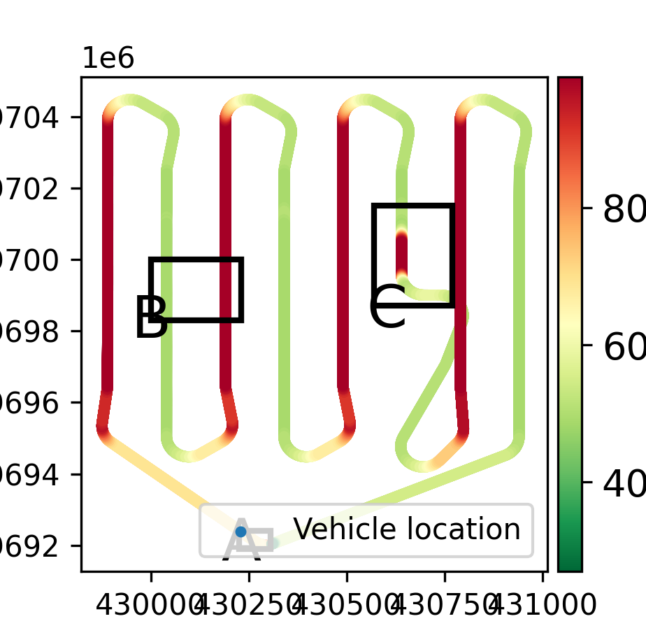
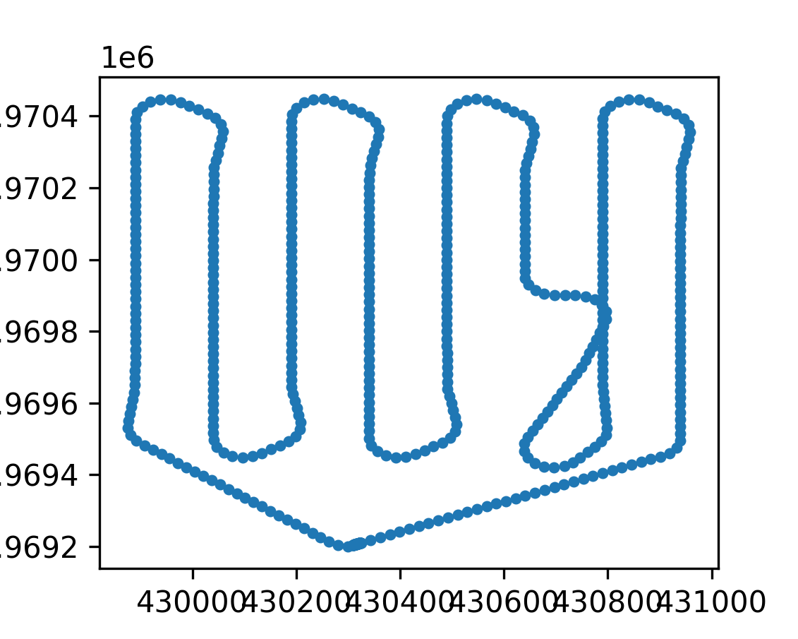

```{r setup, include=FALSE}
knitr::opts_chunk$set(echo = TRUE, eval = FALSE)

def.chunk.hook  <- knitr::knit_hooks$get("chunk")
knitr::knit_hooks$set(chunk = function(x, options) {
  x <- def.chunk.hook(x, options)
  ifelse(options$size != "normalsize", paste0("\n \\", options$size,"\n\n", x, "\n\n \\normalsize"), x)
})
```

```{r logo, eval=TRUE, echo=FALSE, message=FALSE, fig.align='center', out.width='0.3\\linewidth', fig.pos='H'}
temp <- tempfile(fileext = ".pdf")
download.file(url = "https://reproducible-agile.github.io/public/images/reproducible-AGILE-logo-square.pdf", destfile = temp)
knitr::include_graphics(path = temp)
```

This report is part of the reproducibility review at the AGILE conference.
For more information see [https://reproducible-agile.github.io/](https://reproducible-agile.github.io/).
This document is published on OSF at [https://osf.io/7twr2/](https://osf.io/7twr2/).
To cite the report use

> _Nüst, D., & Ostermann, F. O. (2020, July 13). Reproducibility review of: Window Operators for Processing Spatio-Temporal Data Streams on Unmanned Vehicles. https://doi.org/10.17605/OSF.IO/7TWR2 _

# Reviewed paper

> _Tobias Werner and Thomas Brinkhoff: Window Operators for Processing Spatio-Temporal Data Streams on Unmanned Vehicles. AGILE GiScience Ser., 1, 21. https://doi.org/10.5194/agile-giss-1-21-2020, 2020._

# Summary

The reproduction was successful.
Based on an updated data and code archive provided by the authors (extending the [original anonymous supplement](https://figshare.com/s/cc758d056c8c6f193e52)), I was able to deploy a database with the newly implemented functions and insert the test data.
All but one data-based figures could be recreated with the provided functions.

\clearpage

# Reproducibility reviewer notes

## Reproduction

Following the instructions in `readme.txt` I conducted the following steps.

### I./II. Database setup and window operators

I started a database locally with Docker using the closely matching tag `11-2.5`:
  
```{bash db_container, size="scriptsize"}
docker run --rm -it --name windowoperators -p 5432:5432 -e POSTGRES_PASSWORD=password postgis/postgis:11-2.5
```
    
Add `auv` database (using a second terminal and the same image):
  
```{bash db_create, size="scriptsize"}
docker run -it --link windowoperators:postgres --rm postgis/postgis:11-2.5 \
  sh -c 'exec psql -h "$POSTGRES_PORT_5432_TCP_ADDR" -p "$POSTGRES_PORT_5432_TCP_PORT" -U postgres'
```
    
```{bash db_create_cmd, size="scriptsize"}
postgres=# CREATE DATABASE auv;
CREATE DATABASE
postgres=# \l
                                    List of databases
       Name       |  Owner   | Encoding |  Collate   |   Ctype    |   Access privileges   
------------------+----------+----------+------------+------------+-----------------------
 auv              | postgres | UTF8     | en_US.utf8 | en_US.utf8 | 
 postgres         | postgres | UTF8     | en_US.utf8 | en_US.utf8 | 
 template0        | postgres | UTF8     | en_US.utf8 | en_US.utf8 | =c/postgres          +
                  |          |          |            |            | postgres=CTc/postgres
 template1        | postgres | UTF8     | en_US.utf8 | en_US.utf8 | =c/postgres          +
                  |          |          |            |            | postgres=CTc/postgres
 template_postgis | postgres | UTF8     | en_US.utf8 | en_US.utf8 | 
(5 rows)
```

Then I ran the creation script from the directory of the file `create_windows.sql`:
  
```{bash db_create_script, size="scriptsize"}
docker run -it --link windowoperators:postgres --rm -v $(pwd):/work postgis/postgis:11-2.5 \
  sh -c 'exec psql -h "$POSTGRES_PORT_5432_TCP_ADDR" -p "$POSTGRES_PORT_5432_TCP_PORT" -U \
            postgres -d auv -a -f /work/create_windows.sql'
Password for user postgres: 
-- PostgreSQL version 11.5
-- PostGIS version 2.5.3
-- Load spatial extension
create extension postgis;
CREATE EXTENSION

[..]
```

### III. Python environment

The authors provide textual instructions for recreating the Python environment using miniconda and list the used versions. Since no ready-to-use environment definition was available and I am not familiar with miniconda, I created a snapshot using Pipenv using local Python 3.8 installation.
The installation of the psycopg2 package from source failed and I installed `psycopg2-binary` in the latest available version instead.
The resulting `Pipfile` is as follows:
    
```{bash pipfile, size="scriptsize"}
[[source]]
name = "pypi"
url = "https://pypi.org/simple"
verify_ssl = true

[dev-packages]

[packages]
geopandas = "==0.6.1"
psycopg2-binary = "==2.8.5"
matplotlib = "==3.2.2"

[requires]
python_version = "3.8"
```
  
### IV. Data insertion

```{bash workflow, size="scriptsize"}
pipenv run python database.py
```

This command starts a counter going up to `35553`, which took at least 12 hours (roughly one insertion per second) on my system (8 cores, 40GB RAM, SSD).
This seemingly long time to insert a small number of records is due to the implemented operators being triggered on every insertion.

### V. Evaluate results and plot figures

Connecting to the database, I see the following tables/values:

```
postgres=# \c auv
You are now connected to database "auv" as user "postgres".
auv=# \dt
                     List of relations
 Schema |              Name              | Type  |  Owner   
--------+--------------------------------+-------+----------
 public | area                           | table | postgres
 public | area_window_result             | table | postgres
 public | jumping_distance_window_result | table | postgres
 public | location_stream                | table | postgres
 public | session_distance_window_result | table | postgres
 public | sliding_distance_window_result | table | postgres
 public | sliding_window_result          | table | postgres
 public | spatial_ref_sys                | table | postgres
 public | tilting_distance_window_result | table | postgres
 public | tilting_waypoint_window_result | table | postgres
 public | tilting_window_params          | table | postgres
 public | tilting_window_result          | table | postgres
 public | waypoints                      | table | postgres
(13 rows)

auv=# SELECT * FROM area_window_result LIMIT 5;
         time          |                        geom                        
-----------------------+----------------------------------------------------
 2019-03-01 12:40:25.8 | 0101000020787F00003A61D1BF763D1A4143FD6A8190C55641
 2019-03-01 12:40:26   | 0101000020787F0000C9D4A7D3753D1A411553938C90C55641
 2019-03-01 12:40:26.2 | 0101000020787F0000DE687EE7743D1A415EAABB9790C55641
 2019-03-01 12:40:26.4 | 0101000020787F0000731D55FB733D1A411C03E4A290C55641
 2019-03-01 12:40:26.6 | 0101000020787F00008AF22B0F733D1A414F5D0CAE90C55641
(5 rows)

auv=# SELECT schemaname,relname,n_live_tup 
auv-#   FROM pg_stat_user_tables 
auv-#   ORDER BY n_live_tup DESC;
 schemaname |            relname             | n_live_tup 
------------+--------------------------------+------------
 public     | tilting_distance_window_result |      35554
 public     | location_stream                |      35554
 public     | session_distance_window_result |      35554
 public     | tilting_window_result          |      35554
 public     | tilting_waypoint_window_result |      35553
 public     | area_window_result             |      29266
 public     | spatial_ref_sys                |       5757
 public     | sliding_distance_window_result |       1364
 public     | jumping_distance_window_result |        543
 public     | waypoints                      |         57
 public     | sliding_window_result          |         16
 public     | tilting_window_params          |          1
 public     | area                           |          1
(13 rows)
```

There are 8 `_result` tables, with different number of rows, as can be expected due to the different operators.

\newpage
## Plots

The following plots were created with these function calls (prepending `pipenv run` to set the computing environment).
Where a file save command was missing, the plots were saved to files manually.
_Fig. 14 seems to be a data-based plot but the code is missing._

Plot density track (Fig. 2), `pipenv run python plot_density_track.py`



\newpage
Plot tilting window (Fig. 9), `pipenv run python plot_tilting_window.py`


\newpage
Plot tilting distance window (Fig. 11), `pipenv run python plot_tilting_distance_window.py`


\newpage
Plot tilting waypoint window (Fig. 13), `pipenv run python plot_tilting_waypoint_window.py`


\newpage
Plot jumping distance window (Fig. 15), `pipenv run python plot_jumping_distance_window.py`



### GStream tool

I can confirm the authors' SQLite package extension compiles following the commands in `travis.yml`: there is a file `libstreams.so` afterwards.
Running `GStream/test/src []$ python gstream_test.py` runs 7 tests and results in a message "OK".
Since the SQLite extension was included for the sake of completeness but was not used in the evaluation of the article, I did not inspect this tool further.

### Conclusion

An excellent example of a reproducible computational workflow, with only some potential to improve automation and documentation for third parties.

## Comments to the authors

The given repository is an excellent attempt at trying to make a workflow reproducible.
The documentation is good, though steps could be automated a little bit further.
I have the following concrete recommendations:

- Provide a reusable snapshot of the environment (`environment.yml`)
- Document expected execution times clearly, with the hardware environment they were based on; ideally, provide a small sample dataset that demonstrates the functionality of the code within a few minutes, and document the expected numerical outcomes
- Document how to determine if the created tables are "correct" (how many rows, what summary statistics to expect)
- Use (and provide) a script for the database creation process (do not assume the person evaluating your work knows SQL)
- Save all plots to files, so display properties can be controlled better

**Comments on first supplement**

The original data and code supplement did not include the code for creating the figures, and lacked a documentation of all steps, e.g., it was unclear how to evaluate the results sets in the window tables.
This supplement is still available online at [https://figshare.com/s/cc758d056c8c6f193e52](https://figshare.com/s/cc758d056c8c6f193e52).
The instructions or code to create the figures from the paper were missing.

```{r, echo=FALSE, eval=FALSE, results='hide'}
library("here")
library("osfr") # See docs at https://docs.ropensci.org/osfr/
# OSF_PAT is in .Renviron in parent directory
# We cannot use osfr to create a new component (with osfr::osf_create_component(x = osfr::osf_retrieve_node("6k5fh"), ...) because that will set the storage location to outside Europe.

# retrieve project
project <- osfr::osf_retrieve_node("7twr2")

# upload files
osfr::osf_upload(x = project,
                 conflicts = "overwrite",
                 path = c(list.files(here::here("2020-011"), pattern = "(pdf$|Rmd$)", full.names = TRUE) #,
                          #c(list.files(here::here("2020-011"), pattern = "png$", full.names = TRUE),
                          #list.files(here::here("2020-011", "updated_figshare_content"), pattern = ".*(png$)", full.names = TRUE),
                          #list.files(here::here("2020-011"), pattern = "Pip", full.names = TRUE)
                          #here("2020-011", "LICENSE"),
                          #here("2020-011", "updated_figshare_content.zip") # files were updated by authors on original figshare
                          )
                 )
```
